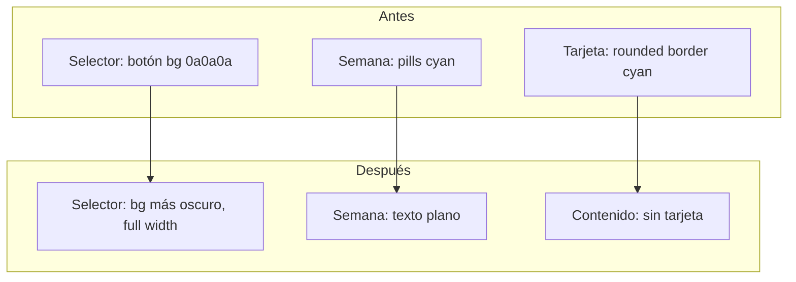

# Rediseño ProgramDetail - Estética "Tú"

## 1. Paleta de colores más sobria (alineada con "Tú")

**Archivos afectados:**

- [components/ProgramDetail.tsx](components/ProgramDetail.tsx): Tabs Entrenar/Analytics (líneas 221-234)
- [components/program-detail/CompactHeroBanner.tsx](components/program-detail/CompactHeroBanner.tsx): Chips Activo/Pausado/Borrador, KPIs de adherencia
- [components/program-detail/TrainingCalendarGrid.tsx](components/program-detail/TrainingCalendarGrid.tsx): Múltiples usos de cyan/emerald
- [components/program-detail/AnalyticsDashboard.tsx](components/program-detail/AnalyticsDashboard.tsx): Bordes, selects, acentos

**Cambios:** Sustituir `cyan-400/500`, `#00F0FF`, `emerald-400/500` por tonos más sutiles:

- Acento principal: `zinc-400` o `white/80` en lugar de cyan brillante
- Bordes activos: `border-white/20` en lugar de `border-cyan-500/40`
- Chips: `bg-white/10 text-white/90` en lugar de cyan
- Conservar solo indicadores críticos (adherencia baja = rojo) con tonos más apagados

---

## 2. Selector de vista (dropdown Bloques/Rutina/Estructura)

**Archivo:** [components/program-detail/TrainingCalendarGrid.tsx](components/program-detail/TrainingCalendarGrid.tsx) (líneas 264-315)

**Cambios:**

- Botón: `bg-[#0a0a0a]` → `bg-black/40` o `bg-[#080808]` (más oscuro que el fondo `#121212`)
- Ocupar todo el ancho: `flex-1 w-full` y contenedor `px-6` sin restricciones
- Al desplegar: opciones con `bg-black/60 backdrop-blur-sm` (fondo oscuro semi-transparente)
- Opción seleccionada: `text-white` en lugar de `text-cyan-400`
- Quitar acentos cyan del dropdown

---

## 3. Selector de semana ("SEMANA 1") y flechas

**Archivo:** [components/program-detail/TrainingCalendarGrid.tsx](components/program-detail/TrainingCalendarGrid.tsx) (líneas 318-376)

**Cambios:**

- Eliminar las tarjetas cyan: los botones de semana ya no tendrán `bg-cyan-500/20 border-cyan-500/40`
- "SEMANA 1" como texto dentro del flujo: `text-sm font-bold text-white` sin bordes ni fondos
- Flechas: mismo tratamiento, sin `rounded-lg bg-white/5 border`; usar iconos mínimos `text-zinc-500 hover:text-white`
- Layout: `flex items-center gap-4` con el texto de semana centrado y flechas a los lados, integrado en el contenido
- Indicador "Actual": `text-[9px] text-zinc-500` en lugar de cyan

---

## 4. Tarjeta semanal integrada en el contenido

**Archivo:** [components/program-detail/TrainingCalendarGrid.tsx](components/program-detail/TrainingCalendarGrid.tsx) (líneas 410-470)

**Cambios:**

- Quitar el contenedor tipo tarjeta: `rounded-2xl border overflow-hidden bg-[#0a0a0a]`
- Cada semana: bloque `w-full` sin bordes redondeados ni sombras
- Cabecera de semana: `text-[10px] font-bold text-zinc-500 uppercase` como texto simple, sin `border-b`
- Sesiones: `divide-y divide-white/5` para separadores mínimos
- La semana seleccionada se distingue con un borde lateral sutil `border-l-2 border-white/20` o similar, no con cyan
- Usar todo el espacio horizontal: `w-full px-6` sin max-width en el contenedor

---

## 5. Tarjeta de fuerza relativa - rediseño completo

**Archivo:** [components/RelativeStrengthAndBasicsWidget.tsx](components/RelativeStrengthAndBasicsWidget.tsx)

**Cambios estructurales:**

- Contenedor: `bg-black` (fondo negro sólido), quitar `rounded-[2rem] border`
- Eliminar el círculo interior: quitar `
` que envuelve la ilustración
- Ilustraciones: usar las nuevas PNG proporcionadas en lugar de SVGs actuales

**Integración de imágenes:**

- Copiar las 4 PNG del workspace a `public/` con nombres estables:
  - `caupolican-squat.png` (Sentadilla)
  - `caupolican-cdl.png` (Peso Muerto Convencional)
  - `caupolican-sdl.png` (Peso Muerto Sumo)
  - `caupolican-bench.png` (Press Banca)
- Los componentes [CaupolicanSquat.tsx](components/CaupolicanSquat.tsx), [CaupolicanCDL.tsx](components/CaupolicanCDL.tsx), etc. pasarán a usar estas PNG (las ilustraciones ya son blancas sobre negro, quitar `brightness-0 invert` si aplica)

**Layout simplificado del slide (PatternSlide):**

- Sin SVG de anillo circular; mostrar ilustración a tamaño adecuado sin contenedor circular
- Datos (título, 1RM, meta): disposición lineal y limpia debajo de la imagen
- Colores: `text-white`, `text-zinc-500` para secundarios; quitar gradientes cyan/emerald
- Barra de progreso opcional: línea horizontal simple en lugar del anillo

---

## 6. Archivos de assets (imágenes)

**Origen (workspace):**

- `assets/.../CaupolicanSquat-....png`
- `assets/.../CaupolicanCDL-....png`
- `assets/.../CaupolicanSDL-....png`
- `assets/.../CaupolicanBench-....png`

**Destino:** `public/caupolican-squat.png`, `public/caupolican-cdl.png`, `public/caupolican-sdl.png`, `public/caupolican-bench.png`

También copiar a `www/` si el build de Capacitor usa ese directorio.

---

## Diagrama de flujo visual (TrainingCalendarGrid - antes/después)

---

## Resumen de archivos a modificar

| Archivo                                                                                | Cambios                                |
| -------------------------------------------------------------------------------------- | -------------------------------------- |
| `ProgramDetail.tsx`                                                                    | Tabs con acentos zinc en lugar de cyan |
| `CompactHeroBanner.tsx`                                                                | Chips y KPIs con paleta sobria         |
| `TrainingCalendarGrid.tsx`                                                             | Selector, semana, tarjeta semanal      |
| `AnalyticsDashboard.tsx`                                                               | Ajuste de acentos a zinc/white         |
| `RelativeStrengthAndBasicsWidget.tsx`                                                  | Rediseño sin círculo, nuevas imágenes  |
| `CaupolicanSquat.tsx`, `CaupolicanCDL.tsx`, `CaupolicanBench.tsx`, `CaupolicanSDL.tsx` | Rutas a PNG en public/                 |
| `public/`, `www/`                                                                      | Copiar 4 PNG de ilustraciones          |

