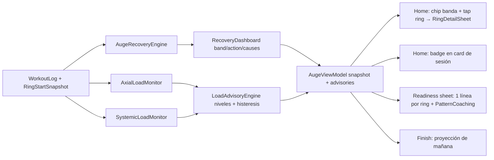

# Auditoría AUGE/RINGS 2026-09-12: fiabilidad y proactividad (Energía, Columna, Axial)

## Veredicto

El sistema **no es todavía "a prueba de balas"**. Los tres problemas de fondo:

- **Columna mide lo que no debe**: el ring drena por `ssc` del catálogo, y el catálogo tiene press banca con barra en `ssc=1.2` (el máximo) con `axialLoadFactor=0`, mientras sentadilla SSB y peso muerto hex-bar tienen `ssc=0.5`. Un día de pecho baja más "Columna" que un día de sentadilla. Además la curva de Columna tiene un salto discontinuo a las 12 h.
- **Energía/Columna aprenden con matemática incompatible**: la inversión de τ usa `τ = 2.9957/k` (semántica "95 % recuperado") pero el forward de Energía/Columna usa `exp(-h/τ)` (e-folding). Una sola calibración manual hace que esos dos rings recuperen ~3× más lento a partir de entonces. Y no existe ningún test numérico de Energía ni Columna porque `nowMs()` es `System.currentTimeMillis()` privado.
- **El cerebro existe pero está oculto**: `RecoveryDashboard` calcula headline, recomendación, acción por canal, banda, causas y confianza, y **nada de eso se pinta**. El usuario ve "62 %" sin saber si es bueno, malo o normal; hay cinco escalas de umbrales distintas en el código.

Conteo: 6 P0, 14 P1, 9 P2. Decisiones de auditorías previas que **no se reabren**: cuestionario 24 h, Sleep AUGE, sliders de sensibilidad en Settings, Health Connect, paridad iOS/backend. Las curvas/caps solo se tocan donde hay bug (discontinuidad, unidades), no para recalibrar sensaciones.

## 1. Hallazgos

### A. Columna (ring + datos)

- **A1 · P0 · Catálogo `ssc` vs `axialLoadFactor` contradictorios** (medido con el JSON real, 1030 perfiles). 42 configuraciones con `axial=0` y `ssc>=0.6`: `bench_press/incline/decline` barra `ssc=1.2`, floor press `1.0`, push-up `0.9`, fondos `0.9`, press spoto `1.2`. 10 con `axial>=0.6` y `ssc<=0.2`: hammer curl, reverse curl (`axial=0.6`, `ssc=0.1`). `conventional_deadlift hex_bar` y `high_bar_back_squat safety_bar`: `axial=1.0`, `ssc=0.5`. El ring de Columna ([AugeRecoveryEngine.kt](android-native/app/src/main/java/com/example/kpkn/domain/auge/AugeRecoveryEngine.kt) 1012) drena `adjustedSpinal` sin ninguna compuerta axial; el editor sí gatea por `axialLoadFactor > 0` ([SessionEditorAugeComputation.kt](android-native/app/src/main/java/com/example/kpkn/screens/sessioneditor/SessionEditorAugeComputation.kt) 647-648, 677). Ring y editor cuentan historias distintas y el monitor axial nacería ciego.
- **A2 · P0 · `getSpinalRecoveryHours` discontinua** ([AugeUtils.kt](android-native/app/src/main/java/com/example/kpkn/domain/auge/AugeUtils.kt) 117-122): `h<12 → h`, `h>=12 → h+18`. A las 11:59 queda `exp(-12/52)=79 %` de la carga; a las 12:00, `exp(-30/52)=56 %`. El ring salta ~10 puntos en un tick del timer de 5 min. La curva muscular (`getSigmoidalHours`) sí es continua en 24 h.
- **A3 · P0 · Semántica de τ incompatible entre inversión y forward** ([AugeAdaptiveEngine.kt](android-native/app/src/main/java/com/example/kpkn/domain/auge/AugeAdaptiveEngine.kt) 34-47 `tau = 2.9957/k`) vs forward Energía `exp(-h/τ)` (AugeRecoveryEngine 834) y Columna `exp(-warp(h)/τ)` (1021). Bajo el forward real, la observación implica `τ_impl = 2.9957·τ_e`; la EMA mezcla 36 h con ~108 h. Con α=0.5 en la primera observación, `cnsRecoveryHours` pasa de 36 a ~72 h de un toque. Para músculos sí es consistente (`k = 2.9957/τ`, 485).
- **A4 · P1 · Dos definiciones de "Columna"**: raw `batteries.spinal` (finish `PostSessionPreview.spinal` 1740; `readinessSpinalStart` en WorkoutScreen 455-458 usa el blended pero guarda raw) vs blended `structureRingScore` (Home 1238: `min(spinal, 0.5·spinal + 0.25·articular + 0.25·guardia)`). Tras un día de espalda (dorsales/erectores bajos) el finish dice 92 y Home 84 un minuto después. El override manual edita el blended pero se ancla al canal raw ([AugeViewModel.kt](android-native/app/src/main/java/com/example/kpkn/screens/auge/AugeViewModel.kt) 349-361): "puse 85 y muestra 80". El aprendizaje de τ espinal también invierte el blended contra el canal raw.
- **A5 · P1 · Piso espinal sin carga axial**: `ensureMinimumHardSessionDrain` ([AugeFatigueEngine.kt](android-native/app/src/main/java/com/example/kpkn/domain/auge/AugeFatigueEngine.kt) 756-768) fuerza `spinal >= 8` con 6+ series duras aunque sean curls. Contamina `sessionStressScore` y el estímulo de aprendizaje τ (`lastSessionDrainOrNull`).
- **A6 · P1 · Cardio no drena Energía ni Columna en el ring**: `calculateSystemicFatigue` (737-845) y `calculateSpinalBattery` (877-1028) no tienen rama `cardioDetails`; `calculateCompletedSessionDrain` (661-668, 819-826) y músculos (547) sí. Un HIIT de 40 min deja Energía intacta mientras el `sessionStressScore` dice lo contrario.
- **A7 · P2 · Causalidad y coste**: `calculateSpineFatigueMultiplier` por log (952-965) recibe el `wellbeing` de hoy con `nowOverride=logTime`; un override manual de hoy tiene anchor futuro respecto al log → `hoursSinceAnchor=0`, carga manual completa aplicada al pasado. Además es O(N²) (3 baterías musculares por log) cada 5 min.

### B. Energía

- **B1 · P0** = A3.
- **B2 · P1 · El ring no puede representar acumulación crónica**: ventana fija de 10 días, sin ACWR (solo Músculos lo tiene, `muscularAcwrFor` 334-350). Estimación analítica con las fórmulas actuales (a confirmar en F0): sesión dura → Energía ≈ 80 al terminar, ≈ 90 a las 24 h, ≈ 95 a las 48 h; solo con 5-6 sesiones/semana baja a ~67. El "50 % de Energía" que pregunta el usuario es casi inalcanzable sin override manual. La proactividad de carga acumulada necesita un monitor aparte (sección 4), no retocar la curva.
- **B3 · P1 · Parámetros legacy zombis**: `cnsLearningDelta`/`spinalLearningDelta` se aplican (1132-1133) y `cnsDrainMultiplier`/`spinalDrainMultiplier` también (807-808, 1000-1001), pero sus escritores (`updateSystemLearningDeltas`, `updateDrainMultipliers`, `updateMuscleDeltas`) tienen 0 callers y la migración v1→v2 solo limpió los mapas musculares. Usuarios antiguos arrastran sesgos congelados de hasta ±15 puntos para siempre.
- **B4 · P1 · `augePredictionBias`** se aplica en `finalizeSessionDrain` (628) mientras su escritor es un stub ([WorkoutViewModel.kt](android-native/app/src/main/java/com/example/kpkn/screens/workout/WorkoutViewModel.kt) 753).

### C. Músculos / capacidad

- **C1 · P1 · Cold-start V2 y finish ≠ Home**: `ATHLETE_CAPACITY` 260-625 (AugeFatigueEngine 35-47) está en unidades legacy; el stress V2 es `drainPct·10` ([MuscularSessionImpactEngine.kt](android-native/app/src/main/java/com/example/kpkn/domain/auge/MuscularSessionImpactEngine.kt) 210). Estimación: pecho duro (fixture del test) ≈ 750 stressUnits → primera sesión de un músculo (o tras >35 días) drena ~90 % en finish (pecho ≈ piso 22). Home un minuto después incluye la sesión en su propia capacidad (`getPerMuscleBatteries` 1182-1196 usa `until evaluationNow`, `AugeMuscleCapacityEngine` la promedia con `weeks>=1` → capacidad 1.8×stress) y muestra ~54 %. El `capacityAtCompletion` guardado en el log **no se usa** en Home (527-538).
- **C2 · P1 · Ruta legacy en el mismo acumulador con unidades ×1** (595-606) frente a V2 ×10 (527-538): el historial anterior a V2 o importado es casi invisible. [AugeRingDrainRealismTest](android-native/app/src/test/java/com/example/kpkn/domain/auge/AugeRingDrainRealismTest.kt) pinnea **solo** la ruta legacy (78-86); ninguna prueba fija el valor V2 inmediato ([AugePostSessionPreviewImmediateTest](android-native/app/src/test/java/com/example/kpkn/domain/auge/AugePostSessionPreviewImmediateTest.kt) solo `>= 0`).
- **C3 · P2 · Soft cap con unidades mezcladas** en la rama V2 (`applySessionSoftCap(stressUnits, accum, cap%)`, 530). Inocuo hoy (una entrada por log), latente.

### D. Aprendizaje de τ

- **D1 · P1 · Un toque mueve τ hasta 2.6×**: primera observación α=0.5; si el usuario dice "estoy más cansado de lo previsto", `remainingFraction→0.99` → τ implícito clamp 200 → músculo 48→124 h (clamp 144). Falta límite por observación.
- **D2 · P1 · Sesgo de progresión en `PerformanceTauLearner`** ([PerformanceTauLearner.kt](android-native/app/src/main/java/com/example/kpkn/domain/auge/PerformanceTauLearner.kt) 273, 409-421): baseline `ermRms` histórico → un atleta que progresa da ratio>1 casi siempre → implied 98 → τ se acorta sistemáticamente → rings cada vez más optimistas.
- **D3 · P1 · Gate axial inconsistente**: el learner por rendimiento exige `AXIAL_MIN=0.6` (233) para Columna, pero `learnFromManualAdjustment` (AugeViewModel 623-740) aprende τ espinal con cualquier sesión previa (y con el piso A5 como estímulo).
- **D4 · P2 · Inversión mono-sesión**: `initialDepletion = max(actual, sessionStress)` ignora la carga acumulada de sesiones anteriores.

### E. Semántica y UI

- **E1 · P0 (producto) · Guía calculada y no mostrada**: `headline/recommendation/channels[].action/band/causes/confidenceLabel` de `RecoveryDashboard` no aparecen en ninguna pantalla (grep en `screens/` = 0 usos). `buildPatternCoaching` ([ExerciseReadinessEngine.kt](android-native/app/src/main/java/com/example/kpkn/domain/auge/ExerciseReadinessEngine.kt) 436) 0 callers. Los rings de Home no son tocables (solo botón info con [RingsInfoDialog](android-native/app/src/main/java/com/example/kpkn/screens/home/HomeRingsSection.kt) 412, que explica qué son, no qué significa el %).
- **E2 · P1 · Cinco escalas distintas**: `recoveryBand` 85/70/50/35 (AugeRecoveryEngine 99); `readinessLabel` 85/75/50/35 (ExerciseReadinessEngine 410); `batteryColor` 80/50 (HomeRingsSection 403); `ADJUSTMENT_THRESHOLD=75`; coaching 75/50; causas <80/<75/<70.
- **E3 · P1 · Readiness sheet ≠ Home** ([WorkoutReadinessSheet.kt](android-native/app/src/main/java/com/example/kpkn/screens/workout/components/WorkoutReadinessSheet.kt)): "Músculos" es el promedio de los músculos de la sesión (Home = 13 pilares + cuartil bajo); el override global se guarda como promedio de músculos editados; `patternReadiness`, `exerciseReadinessMap`, `perMuscle` se reciben y no se usan.
- **E4 · P2 · Deload muerto**: `augeAutoDeload` sin UI (default false); `cumulativeFatigue>75` casi siempre true → gate real `readiness<40` inalcanzable con pisos 22-26. `augeFatigueSensitivity` solo entra en un hash. `OvertrainingDetector.factorLocal` depende de `PostSessionFeedback`, que nunca se escribe.
- **E5 · P2 · Confianza inflada**: `recentSessionCount = history.size` (AugeViewModel 246, 900).
- **E6 · P2 · Anchor manual**: sin `manualBatteryAnchorMs` cae a `nowMs()` (143-152) → ring congelado todo el día; expiración a 18 h en escalón ([AugeRepository](android-native/app/src/main/java/com/example/kpkn/data/repository/AugeRepository.kt) `getActiveWellbeingWithManualOverrides`).

### F. Testabilidad y arquitectura

- **F1 · P0 · Reloj no inyectable**: `nowMs()` privado (97) usado por Energía (746) y Columna (887); imposible fijar valores a 24/48/72 h. Es la causa de que no exista ningún test numérico de esos rings.
- **F2 · P2** `getNutritionMultiplier` llama `NutritionRepository.getInstance()` desde `domain/`.
- **F3 · P2** `recompute()` corre sin `augeWriteMutex` desde `init`/`refresh()` mientras `applyManualBatteries` lee-modifica-escribe el adaptive cache → lost update posible.

## 2. Contrato único de semántica de %

Una sola fuente en `domain/auge/RecoveryBands.kt` (nuevo), reutilizando los umbrales actuales de `recoveryBand` y sustituyendo `readinessLabel`, `batteryColor`, coaching y causas:

- **85-100 · Alta**: fresco; se puede empujar (PR, series extra). En Energía es lo habitual con 3-4 sesiones/semana; en Músculos justo tras entrenar es raro.
- **70-84 · Normal**: entrena según plan. Estado esperado 24-48 h después de una sesión normal.
- **50-69 · Moderada**: entrena, pero con 1-2 RIR más o -10/15 % de volumen en el canal limitante; sin PRs. Habitual el día siguiente a una sesión muy dura o en semanas de 5-6 sesiones.
- **35-49 · Baja**: cambia el estímulo (técnica, variantes sin carga axial si es Columna, -20 % carga); valora descanso.
- **<35 · Crítica**: descarga o descanso activo. Banda estrecha por diseño: los pisos por `AthleteType` (18-26) hacen que 0 % no exista; el copy lo dice.

Complementos que sí responden "qué es normal conforme pasa el tiempo":

- **Tu normal**: P25-P75 personal del ring al inicio de sesión en los últimos 28 días ("Hoy 72 % · tu rango habitual al empezar: 68-84 %"). Se alimenta de un `RingStartSnapshot` guardado en `WorkoutLog` (JSON en Room, sin migración).
- **Proyección**: tiempo hasta volver a ≥70 % (forma cerrada para Energía/Columna: `t = τ·ln(carga/carga₇₀)`; para Músculos `hoursToRecovery` ya existe). "Vuelve a Normal en ~14 h".
- **Tabla de referencia real** (F0): harness que imprime Energía/Columna/pecho a 0/12/24/48/72 h para sesión ligera/media/dura y frecuencias 1×/3×/5× semana. Ancla el copy en el modelo, no en intuición.

## 3. Proactividad no invasiva (sin modales ni preguntas nuevas)

- **Home**: chip de banda bajo cada ring; línea `headline` ya calculada; tap en ring → `RingDetailSheet` (banda y significado, "tu normal", causas, acción, proyección, confianza, sparkline 14 d).
- **Readiness sheet**: una línea por ring (banda + acción) y `PatternCoaching` de la sesión de hoy (ya se calcula, hoy se descarta).
- **Card de sesión en Home**: badge solo cuando el nivel del monitor es ≥ ADJUST ("Columna: 3 sesiones axiales en 4 días · hoy -10 % en sentadilla").
- **Finish**: una línea "Mañana: Energía ~88 %, Columna ~90 %".
- **Anti-fricción**: máximo un aviso por superficie; clave `(tipo, semanaISO)`; descartable; persistido en `AugeAdaptiveCache` (JSON); nunca bloquea empezar; sin notificaciones push nuevas.

## 4. Monitores de carga acumulada

Motores puros en `domain/auge/` (sin `android.*`), consumidos por `AugeViewModel.recompute()`:

- **`AxialLoadMonitor`** (Columna). Unidad: `axialUnits(sesión) = Σ series efectivas × axialLoadFactor (solo ≥0.5) × factor de carga relativa` (reutiliza `estimateRelativeLoadRatio`/RPE). Métricas: axial 7 d vs promedio semanal 28 d (ACWR axial con `AugeClassifiers.computeAcwr`), días axiales en 7, días axiales consecutivos, sesiones "pesadas" (≥ P75 personal), tendencia de Columna al inicio de sesión (snapshots). Requiere ≥4 sesiones axiales en ≥14 d; si no, `insufficientData`.
- **`SystemicLoadMonitor`** (Energía). Unidad: drain CNS por sesión (`calculateCompletedSessionDrain().cns` corregido por A5/A6). Métricas: ACWR 7/28, sesiones en 7 d, tendencia de Energía al inicio.
- **`LoadAdvisoryEngine`** común. Niveles: `NONE`, `WATCH` (ACWR 1.2-1.4 o 3 días axiales en 4), `ADJUST` (ACWR >1.4, o ring <60 al inicio de 2 sesiones consecutivas, o 4+ días axiales en 6), `UNLOAD` (ACWR >1.6 con 3 semanas al alza, o ring <50 en 3 inicios consecutivos, o 3 semanas ≥1.3× la base). Histéresis: se sale de un nivel al caer 10 % bajo su umbral; baja como máximo un nivel por día.
- **Sugerencias concretas**: bajar 10-15 % la carga tope de los dos ejercicios más axiales de la próxima sesión; sustituir uno por variante del mismo `replacementGroup` con `axialLoadFactor ≤ 0.3`; o semana ligera. Solo texto y, si el usuario quiere, aplicar el ajuste con `ExerciseReadinessEngine` ya existente.
- **Guardia de datos**: test `CatalogAxialSscConsistencyTest` que falla si `axial=0 && ssc>=0.9` o `axial>=0.6 && ssc<=0.2`, para que el arreglo de datos pase por `scripts/compile_exercise_catalog_v2.py` y no se regrese.

## 5. Fases

- **F0 · Fundaciones y caracterización (no cambia números)**: reloj inyectable en `calculateSystemicFatigue`/`calculateSpinalBattery` (F1); harness `AugeRingCharacterizationTest` que imprime y pinnea Energía/Columna/pecho-V2 a 0/12/24/48/72 h y frecuencias 1×/3×/5×; `CatalogAxialSscConsistencyTest` (inicialmente documenta los infractores); copia de este plan a `.opencode/plans/2026-09-12_auge-rings-fiabilidad-proactividad.md` con `flags: [auge]`.
- **F1 · P0 del modelo**: A2 warp espinal continuo; A3 unificar semántica (forward de sistema con `k=2.9957/τ` o inversión por canal) + `schemaVersion 3` que resetea τ de sistema aprendidos con la fórmula errónea y pone a cero B3; quitar B4; compuerta axial en el drain espinal del ring (A1, `ssc × gate(axialLoadFactor)`, sin catálogo se mantiene `ssc`); A5 piso solo si hay share axial; A6 cardio en Energía/Columna.
- **F2 · Consistencia finish ↔ Home ↔ readiness**: A4 una sola "Columna" (blended en todas las superficies; el override invierte el blend para anclar el canal raw); C1 Home normaliza cada log V2 por su `capacityAtCompletion` y prior de cold-start en stressUnits; E3 la readiness sheet muestra el ring de Home y aparte los músculos de la sesión, sin override global por promedio; E6 anchor sin `nowMs()`.
- **F3 · Aprendizaje τ robusto**: D1 límite ±25 % por observación; D2 solo el bajo rendimiento alarga τ, un PR como máximo confirma `predicted+ruido`; D3 gate axial también en manual; predicción del canal raw para la inversión (A4).
- **F4 · Contrato de bandas y guía**: `RecoveryBands` único; copy por banda y canal; `RingDetailSheet`; chips y headline en Home; líneas + `PatternCoaching` en readiness; proyección en finish; "tu normal" con `RingStartSnapshot`.
- **F5 · Monitores de carga**: `AxialLoadMonitor`, `SystemicLoadMonitor`, `LoadAdvisoryEngine`; `advisories` en `AugeSnapshot`; badge en card de sesión; línea en readiness; descartes persistidos; retirar o recablear la card de deload muerta (E4) al monitor.
- **F6 · Datos de catálogo (decisión)**: corregir `ssc`/`axialLoadFactor` en `catalog/exercises/v2/source` y recompilar con el script documentado; la compuerta de F1 se mantiene igual.

Cada fase cierra con auto-auditoría severa y bloque de alineación, y reinstala el APK en el emulador `device`.

## Rutas

- Motor: [AugeRecoveryEngine.kt](android-native/app/src/main/java/com/example/kpkn/domain/auge/AugeRecoveryEngine.kt), [AugeUtils.kt](android-native/app/src/main/java/com/example/kpkn/domain/auge/AugeUtils.kt), [AugeAdaptiveEngine.kt](android-native/app/src/main/java/com/example/kpkn/domain/auge/AugeAdaptiveEngine.kt), [AugeFatigueEngine.kt](android-native/app/src/main/java/com/example/kpkn/domain/auge/AugeFatigueEngine.kt), [PerformanceTauLearner.kt](android-native/app/src/main/java/com/example/kpkn/domain/auge/PerformanceTauLearner.kt), [ExerciseReadinessEngine.kt](android-native/app/src/main/java/com/example/kpkn/domain/auge/ExerciseReadinessEngine.kt); nuevos `RecoveryBands.kt`, `AxialLoadMonitor.kt`, `SystemicLoadMonitor.kt`, `LoadAdvisoryEngine.kt`, `AugeClock.kt`.
- Modelos: [AugeModels.kt](android-native/app/src/main/java/com/example/kpkn/data/models/AugeModels.kt), [AugeAdaptiveModels.kt](android-native/app/src/main/java/com/example/kpkn/data/models/AugeAdaptiveModels.kt) (schemaVersion 3, descartes), [WorkoutLog.kt](android-native/app/src/main/java/com/example/kpkn/data/models/WorkoutLog.kt) (`RingStartSnapshot`, JSON sin migración Room).
- Presentación: [AugeViewModel.kt](android-native/app/src/main/java/com/example/kpkn/screens/auge/AugeViewModel.kt), [HomeRingsSection.kt](android-native/app/src/main/java/com/example/kpkn/screens/home/HomeRingsSection.kt), [HomeScreen.kt](android-native/app/src/main/java/com/example/kpkn/screens/home/HomeScreen.kt), [HomeSessionSection.kt](android-native/app/src/main/java/com/example/kpkn/screens/home/HomeSessionSection.kt), [WorkoutReadinessSheet.kt](android-native/app/src/main/java/com/example/kpkn/screens/workout/components/WorkoutReadinessSheet.kt), [WorkoutFinishHost.kt](android-native/app/src/main/java/com/example/kpkn/screens/workout/WorkoutFinishHost.kt), [WorkoutScreen.kt](android-native/app/src/main/java/com/example/kpkn/screens/workout/WorkoutScreen.kt).
- Datos (F6): `catalog/exercises/v2/source`, `scripts/compile_exercise_catalog_v2.py`.

## Impacto

- Rings de Columna y Energía cambian de valor tras F1/F2 (por diseño: hoy miden mal). Se comunica en el `RingDetailSheet` la primera vez ("modelo actualizado").
- Reset de τ de sistema y de sesgos legacy en `schemaVersion 3`; los τ musculares se conservan.
- Sin migración Room (v25 se mantiene): todo lo nuevo va en blobs JSON con defaults.
- Sin nuevas preguntas al usuario, sin notificaciones, sin sliders. Solo texto contextual y un sheet al tocar el ring.
- iOS/backend fuera de alcance (decisión previa); se documenta la deuda de paridad.

## Pruebas

- F0: `AugeRingCharacterizationTest` (tabla pinneada por canal/tiempo/frecuencia), `CatalogAxialSscConsistencyTest`.
- F1: `SpinalWarpContinuityTest` (|Δ| ≤ 1 punto alrededor de 12 h), `SystemTauRoundTripTest` (observación sintética → τ implícito == τ forward ±5 %), `SpinalAxialGateTest` (press banca ≈ 0 spinal; sentadilla > 0), `HardSessionSpinalFloorTest` (curls → spinal 0), `CardioSystemicDrainTest`, `AdaptiveCacheSchema3MigrationTest`.
- F2: `SpineRingSingleDefinitionTest` (finish == Home ± 1 con guardia baja), `ManualSpinalOverrideSticksTest`, `MuscleColdStartParityTest` (finish == Home ± 2 en primera sesión), `ReadinessSheetHomeParityTest`.
- F3: `TauObservationCapTest`, `PerformanceTauProgressionBiasTest`, `ManualSpinalLearningAxialGateTest`.
- F4: `RecoveryBandsSingleSourceTest` (todas las etiquetas/colores derivan de `RecoveryBands`), `RingProjectionTest`, `PersonalBaselineTest`.
- F5: `AxialLoadMonitorTest` (3 sesiones axiales en 4 días → ADJUST; sin datos → NONE), `SystemicLoadMonitorTest`, `LoadAdvisoryHysteresisTest`, `AdvisoryDismissalTest`.
- Comandos: `testBaseDebugUnitTest --tests '*.Auge*'`, `--tests '*.Catalog*'`, `--tests '*.Workout*Readiness*'`; `compileBaseDebugKotlin` antes de `installBaseDebug`; QA en emulador con capturas en `docs/audits/2026-09-12-auge-rings/`.

## Riesgos

- Recalibrar la compuerta axial y el cold-start cambia números que el usuario ya conoce: mitigación con harness F0 antes/después y nota en el sheet.
- Corregir A3 invalida τ de sistema aprendidos: se resetean (decisión 3), no se convierten.
- Compuerta axial con catálogo incompleto: ejercicios custom sin `axialLoadFactor` mantienen `ssc` heurístico; se registra en diagnóstico.
- O(N²) espinal + monitores: medir en `recompute()`; si supera 150 ms en 30 días de historia, cachear guardia por día.
- Falsos positivos del monitor con historial corto: umbral mínimo de datos y `WATCH` silencioso (solo visible en el sheet, no en badge).

## Decisiones abiertas (default recomendado entre paréntesis)

1. C1 · Expresar la capacidad base en stressUnits (prior de cold-start) aunque toque `ATHLETE_CAPACITY` (sí: es un bug de unidades, no una recalibración de sensación).
2. F6 · Corregir datos de catálogo `ssc`/`axial` vía script además de la compuerta en código (sí).
3. A3 · Resetear τ de Energía/Columna aprendidos con la fórmula errónea al migrar a `schemaVersion 3` (sí; conservar τ musculares).
4. A4 · "Columna" única = blended en todas las superficies (sí; el override ancla el raw invirtiendo el blend).