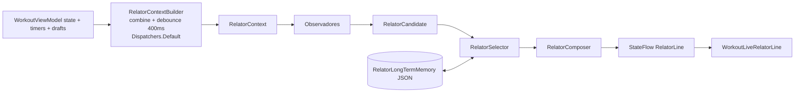
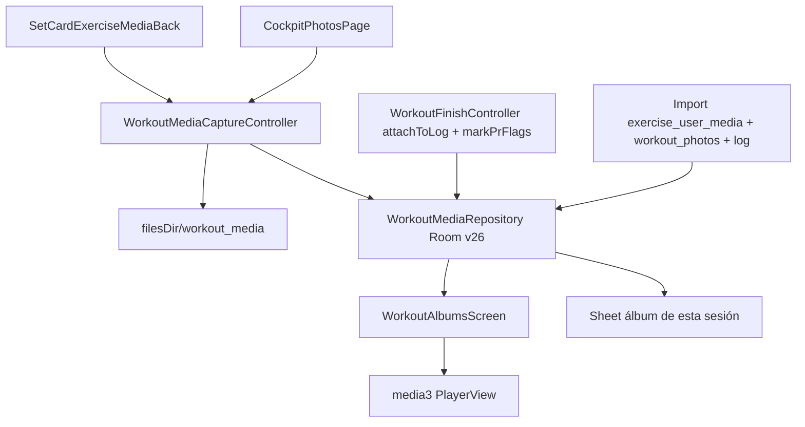

# Sesión en vivo — Relator 2.0 y medios

Fecha: 2026-09-14. Fuente: plan Cursor `sesión_en_vivo_auditoría,_relator_2.0_y_medios_0279ecc4`. Informe F0: [`docs/audits/2026-09-14-live-session/README.md`](../../docs/audits/2026-09-14-live-session/README.md).

Alcance Android. iOS/backend escalados. **F0 (este documento + el informe) no toca código de producto.** Construcción: F1 → F2 → F3 → F4 → F5. No saltar F0. F5 no empieza hasta álbumes y el fix de vídeo.

Room actual: **v25** (`KpknDatabase.kt`). F3 sube a **v26** → flag `[room]` obligatorio.

## Decisiones de producto (bloqueadas)

No reabrir en construcción salvo anulación escrita del usuario.

1. **Relator inteligente sin LLM, solo texto (sin TTS).** Reglas + memoria + variedad. La voz (`services/workout/`) queda fuera de alcance.
2. **Medios en `filesDir` privado** (local-first) + **Compartir / Guardar en galería** por elemento + **export** en Ajustes > Datos.
3. **Trayectoria ML Kit Pose = F5** con feature flag, después de álbumes y el bug de vídeo.
4. **Descanso: `RestTimerOverlay` Y `RestLiveCard` se conservan.** Overlay expandido (`WorkoutRestOverlayHost`) vs tarjeta al minimizar (`isRestMinimized` / `toggleRestMinimized`). Ambas leen `restTimer.remaining`. **No es duplicidad.** No eliminar ni fusionar; F4 solo paridad de acciones y del relator.
5. **Modo Dios fuera de alcance.** Recortes intencionales: `GodModeSessionBoard` (sin callers de producción), `godModeUndoStack`. **No son bugs.** No borrar, no recablear, no “completar”. El pager puede seguir con `godModeActive = false`.

## Rutas

| Área | Archivos |
|------|----------|
| God-state / UI vivo | `screens/workout/WorkoutUiModels.kt`, `WorkoutScreen.kt`, `WorkoutV2Body.kt`, `WorkoutViewModel.kt`, `components/SetExecutionCard.kt` |
| Timers | `RestTimerController.kt`, `WorkoutPacingController.kt`, `WorkoutOverlayHost.kt`, `components/WorkoutRestOverlay.kt`, `components/RestLiveCard.kt` |
| Persistencia ongoing | `WorkoutPersistenceController.kt`, `WorkoutSetRecorder.kt`, `WorkoutLoadSuggestionController.kt`, `data/db/Entities.kt` (`OngoingWorkoutState.toEntity`), `data/repository/ProgramRepository.kt` |
| Relator hoy | `WorkoutLiveRelator.kt`, `WorkoutLiveRelatorCatalog.kt`, `WorkoutLiveRelatorAssist.kt`, `WorkoutLiveRelatorHost.kt`, `WorkoutLiveRelatorBar.kt`, `WorkoutLiveRelatorContext.kt`, `RelatorSpeechVariety.kt`, `domain/concepts/RelatorConceptCue.kt` |
| Relator 2.0 (F2, no existe) | `domain/relator/*` (nuevo), `WorkoutSessionHydrator.kt`, `domain/training/PlanMaterializer.kt`, `data/models/Program.kt`, `data/models/Session.kt` |
| Medios hoy | `components/SetCardExerciseMediaBack.kt`, `components/ExerciseUserMediaStore.kt`, `components/WorkoutSessionCockpit.kt` (`CockpitPhotosPage`), `WorkoutViewModel.kt` (`addExercisePhoto` / `addSessionPhoto`), `data/models/WorkoutLog.kt` |
| Medios F3 (nuevo) | `data/db/` Room 26 + `app/schemas/.../26.json`, `WorkoutMediaStore`, `WorkoutMediaRepository`, `screens/albums/*`, `navigation/Navigation.kt`, `res/xml/provider_paths.xml` |
| Competiciones (no tocar store) | `data/competitions/CompetitionMediaStore.kt`, `screens/competitions/ProfileCompetitionsArchive.kt` |
| Tests | `app/src/test/.../screens/workout/` (58 archivos), `app/src/androidTest/.../screens/workout/` (5 archivos) |
| Fuera | `services/workout/` (voz/TTS), `ios-native/`, `backend/`, Modo Dios |

## Impacto

- **F0:** solo documentos. Sin bump Room. Sin APK.
- **F1:** Compose/VM de sesión en vivo. Sin migración Room. Sin rediseño. Modo Dios intacto.
- **F2:** motor puro en `domain/` (sin `android.*`). Campos opcionales en `Exercise`/`ExerciseSet` (default, **sin** migración Room). `Settings.relatorMemoryJson` nuevo. Resolver actual envuelto, no reescrito a ciegas.
- **F3:** **Room 25→26** (`workout_media`). Import único de tres silos. `CompetitionMediaStore` intacto. FileProvider `workout_media/`. Dependencia media3.
- **F4:** paridad de las dos vistas de descanso (ninguna se borra). Sin Modo Dios.
- **F5:** dependencia ML Kit Pose, flag default **false**, análisis offline.

## Pruebas

F0 no ejecuta Gradle de producto (no hay cambios compilables).

A partir de F1, al cierre de cada fase:

- `compileBaseDebugKotlin`
- `testBaseDebugUnitTest` dirigido (filtros abajo)
- `installBaseDebug` + relanzar `com.example.kpkn/.MainActivity` en emulador `device`

Filtros por fase:

- **F1:** `WorkoutPersistenceDebounceTest` (ampliar coalescing), tests de `LoadSuggestion` incremental, regresiones de cada `!!` eliminado, `RestTimerControllerTest`, `WorkoutPagerSyncTest`
- **F2:** `domain/relator/*` + `WorkoutLiveRelatorTest` (debe seguir verde) + corpus 30 series + plan-aware + memoria larga
- **F3:** DAO/migración 25→26, import legado, `markPrFlags`, Finalize puro; QA emulador álbum/visor
- **F4:** paridad overlay/card (unit del wiring + QA)
- **F5:** JVM landmarks sintéticos; QA clip real (emulador no aporta cámara)

Matriz vigente (recuento 2026-09-14): **58** archivos unit / **439** `@Test` bajo `screens/workout`; **5** archivos instrumented / **26** `@Test`. Detalle en el informe F0.

## Riesgos

- Jank del god-state 1 Hz + pager de 5 cards (3036 líneas c/u) si F2/F3 se adelantan a F1.
- Pérdida de vídeos (`unbindAll` + delete on `Finalize` error) hasta F3.
- Migración Room 26: índices, import legado, FileProvider mal declarado → crash al compartir.
- `WorkoutLiveRelatorTest` (1687 líneas, 81 tests) se rompe si no se envuelve el resolver actual.
- `runBlocking` en `cancelWorkout` / `ProgramRepository.updateOngoingWorkout`: no ampliar; el write vivo ya usa `updateOngoingWorkoutAndFlush`.
- Relator tapado por el overlay expandido: paridad F4, no “unificar” vistas.
- ML Kit en emulador: F5 flag off; análisis offline con clip.
- Paridad iOS/backend: no está en este plan.

---

## Hallazgos F0 (resumen; evidencia en el informe)

P0: god-state 130 campos colectado en `WorkoutScreen.kt:261`; ticks cardio `WorkoutViewModel.kt:4419–4440` y movilidad `:4128–4147`; pager `beyondViewportPageCount = 2` (`WorkoutV2Body.kt:1514`); `SideEffect` `:886–898`; persist `WorkoutSetRecorder.kt:502–503` + `Entities.kt:120`; vídeo `SetCardExerciseMediaBack.kt:157–159`, `:325–334`, `:401–421`.

P1: `!!` listados (RestLiveCard 113, V2Body 1723/1836/2196, StructureSheetsHost 322/965/1268/1321/1393/1542, SessionOverlaysHost 139, SetPager 1266, WarmupMobilityLiveCards 146/234); readiness `WorkoutScreen.kt:336` sin `session` en keys; relator `speechBucket()` `:283–381`, 3 variantes, memoria 12, idle 28 s; snapshot Compose `WorkoutLiveRelatorHost.kt:134–155`; ghost `WorkoutScreen.kt:535–539`.

P2: `completeRestIfStuckAtZero` en Screen `:754` y OverlayHost `:57`; `.first()` V2Body `:696`/`:711` **ya guardados** con `isNotEmpty()`; KDoc persist vs IO; hosts movilidad/warmup huérfanos; `addExercisePhoto` sin UI; campo muerto `sessionTimeRemainingSeconds`.

No-bugs: Modo Dios; las dos vistas de descanso.

---

## Fases de construcción (no ejecutar en F0)

### F0 — Informe + espejo (esta entrega)

- `docs/audits/2026-09-14-live-session/README.md`
- `.opencode/plans/2026-09-14_live-session-relator-media.md` (este archivo)

### F1 — Quick wins de rendimiento y bugs

- Sacar ticks 1 Hz de cardio/movilidad a `StateFlow`s; colectar solo en cards.
- `beyondViewportPageCount = 1`; `isSettledPage` en `SetExecutionCard`; `LaunchedEffect(pagerState.settledPage)` en lugar del `SideEffect` `:886`.
- `remember`/`derivedStateOf` para ghost/weight en `WorkoutScreen.kt:535–539` y snapshot del relator (memo por exercise id / perfil de catálogo).
- `refreshLoadSuggestions` incremental (solo ejercicio afectado) en `Dispatchers.Default`.
- Coalescer `persist(immediate=true)` ~150 ms; mantener `persistAndAwait` tras serie. Alinear KDoc VM `:2142` con `WorkoutPersistenceController.persist` (no bloquea Main).
- Quitar los `!!` F0; key de sesión en `LaunchedEffect` de readiness; un solo `completeRestIfStuckAtZero`; `firstOrNull()` en `:696`/`:711`.
- Borrar campo muerto `sessionTimeRemainingSeconds` del god-state. Verificar `runBlocking`: `flushForBackgroundBlocking` solo `onCleared`; `cancelWorkout` `:5238` no desde Compose caliente.
- Borrar `WorkoutMobilityOverlayHost` / `WorkoutWarmupOverlayHost` (conservar `WorkoutRestOverlayHost`); `addExercisePhoto`/`removeExercisePhoto` (F3 los sustituye). **Nada del Modo Dios.**
- Tests: coalescing, load incremental, `!!`.

### F2 — Relator 2.0 (motor puro + contexto de plan)

- Motor puro `domain/relator/`: Context, Candidate, Observer, Selector, Composer, Memory. Resolver actual = `ReactionObserver` + `StructureAssistObserver` para que `WorkoutLiveRelatorTest` siga verde.
- `LivePlanContext` en `WorkoutUiState`, hydrator desde `Program`: `sourceProtocolId`, `mode`, `trainingPhase`, `goals`, `autoregulationMode`, `Block.goal`/`progressionScheme`, semana en bloque, `sourceRecipe.progression` / `autoregulationHooks`.
- `PlanMaterializer`: persistir opcionales `Exercise.slotRole`, `ExerciseSet.isTopSet`, `ExerciseSet.loadBasis`, `Exercise.techniqueModifier` (defaults, sin migración Room).
- Observadores: Plan, History, SessionProgress, Rest (independiente de `isRestMinimized`; `RestLiveCard` es superficie válida), Readiness (cablear `AugeRecoveryEngine.calculateDailyReadiness` y `getTodayWellbeing` al VM), Technique, Milestone, Warmup, Coach (absorbe `WorkoutCoachMessages`; permite borrar `WorkoutGuidanceComponents`), Media (hook F3).
- Acciones nuevas en `RelatorAssistActionKind` mapeadas a métodos existentes; `performRelatorAssist` (`WorkoutViewModel.kt:3420–3519`) `when` exhaustivo. Ack `ASSIST_CONFIRM`.
- Anti-predictibilidad: cooldown por tema, no el mismo tema dos veces seguidas salvo reacción, memoria 12 + JSON largo, semilla `hash(sessionId, setKey, idleCycle)`, idle adaptativo (rest 18 s, working 28 s, freeze al escribir).
- Rendimiento: snapshot **fuera** de Compose; `debounce(400)` en Default; Compose solo `StateFlow<RelatorResolution>`. Desaparece `rememberLiveRelatorSnapshot`.
- Tests: corpus 30 series; plan-aware 5/3/1, Smolov, Westside ME, KPKN nativo; readiness baja; memoria larga; `< 1 ms`.

### F3 — Medios unificados y álbumes (Room 26)

- `WorkoutMediaEntity` + DAO + migración 25→26 + schema `26.json`. Actualizar AGENTS.md/CLAUDE.md v25→v26.
- Store `filesDir/workout_media/yyyy-MM/id.jpg|mp4` + thumbs. Import legado con flag `workoutMediaLegacyImportDone`. `WorkoutLog.exercisePhotos/sessionPhotos` solo lectura compat.
- Fix vídeo: thumb JPEG + duración (`MediaMetadataRetriever`); media3; no `unbindAll` con grabación activa; esperar Finalize; conservar archivo si `length > 0`; pedir `RECORD_AUDIO` (si niega, mudo); cámara solo página asentada + cara Media; HD con fallback SD (hoy está **solo SD**).
- Card: liga captura a serie (`setIndex`/`side`/kg/reps/`isPr`); miniaturas con ▶ y duración; icono Álbum → sheet; `CockpitPhotosPage` sobre el repo.
- Álbumes `screens/albums/`: rutas `profile/albums`, `profile/albums/{albumKey}`, `media/{mediaId}`; FileProvider `<files-path name="workout_media" path="workout_media/"/>`; guardar galería (MediaStore insert); borrar; caption; entrada Profile; export zip Ajustes > Datos; API `prHighlights`.
- `CompetitionMediaStore` no se toca.

### F4 — UX (solo lo aprobado)

Por defecto:

- Paridad overlay ↔ card: −15/+15, saltar, adaptativo, skip-ejercicio (hoy solo en overlay `:693`), misma línea del relator. **Ninguna vista se elimina.**
- Una política de descanso atascado en cero.
- Un número de carga en la card; relator explica; voz solo si `voiceAutoSuggestLoads`.
- Atajo PR foto/vídeo en Opciones avanzadas.
- Modo Dios intacto.

Opcional (aprobación extra): visor media3 en `ProfileCompetitionsArchive.kt:285` sin tocar el store de competiciones.

Cualquier otra propuesta del informe F0 exige aprobación explícita.

### F5 — Trayectoria (flag, tras F3)

- `com.google.mlkit:pose-detection` (base), ambos flavors.
- Flag `WorkoutFeatureFlags.poseTrajectoryEnabled` default **false** (campo aún no existe).
- Offline ~10 fps → sidecar `<id>.pose.json`; métricas puras `domain/biomechanics/TrajectoryMetrics`; overlay Canvas sobre `PlayerView` sync `player.currentPosition`.
- Punto de seguimiento según `RelatorFamily` (SQUAT/HINGE/PRESS/PULL).
- Tests JVM sintéticos. QA dispositivo real.

---

## Cierre de fase (reglas del repo)

Desde F1: `compileBaseDebugKotlin` + test dirigido + `installBaseDebug` y relanzar. Doble auto-auditoría + Auditoría de Alineación. Hotfix P0/P1 del alcance antes de la siguiente fase. `MEMORY.md` con regresiones **confirmadas en código** (F0 no añade regresiones implementadas).

## Fuera de alcance

- TTS del relator y cambios en `services/workout/`.
- Paridad iOS/backend.
- UI Wrapped (solo API `prHighlights`).
- Modo Dios.
- Fusionar o borrar `RestTimerOverlay` / `RestLiveCard`.
