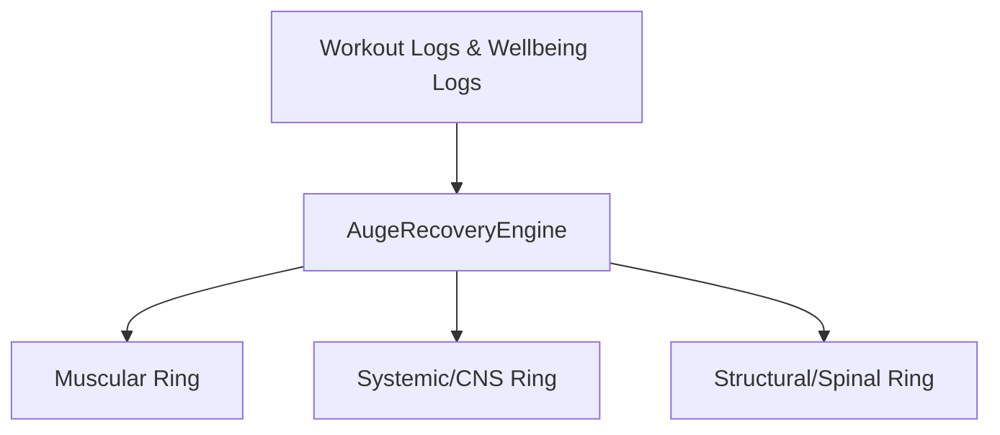

# Technical Mapping: KPKN Fit Android Architecture (For iOS Porting)

This document provides a comprehensive technical mapping of the native Android Kotlin codebase of KPKN Fit. It outlines every system, database table, domain logic engine, screen, and background service to ensure a 100% parity port to iOS (using SwiftUI, Swift Concurrency, SwiftData/CoreData, etc.).

---

## 🗂️ 1. General Architecture Stack

*   **Language:** Kotlin 1.9+ (Native)
*   **UI Framework:** Jetpack Compose (Declarative UI)
*   **Database:** Room (SQLite abstraction) with FTS4 (Full-Text Search)
*   **Concurrency:** Kotlin Coroutines & Flows (Reactive UI updates)
*   **Dependency injection:** Manual constructor injection orchestrated in `MainActivity.kt` and ViewModels (No Hilt/Dagger overhead).
*   **Performance Monitoring:** Android `StrictMode` enabled in debug builds to catch main-thread disk I/O and SQLite leaks.

---

## 🗄️ 2. Database Schema & Data Persistence

KPKN Fit uses a **local-first (offline-first)** data architecture. The Room database is defined in `com.example.kpkn.data.db.KpknDatabase`. Most complex objects are serialized to JSON strings using Kotlinx Serialization and stored directly in text columns.

### 2.1 SQLite Table Definitions (`Entities.kt` & `WikiLabEntities.kt`)

| Table Name | Entity Class | Primary Key | Indices | Serialization Details |
| :--- | :--- | :--- | :--- | :--- |
| `programs` | `ProgramEntity` | `id` (String UUID) | None | Full `Program` struct serialized to JSON string in `data`. |
| `workout_logs` | `WorkoutLogEntity` | `id` (String UUID) | `programId`, `date`, `sessionId` | Serialized `WorkoutLog` JSON string in `data`. |
| `competition_records` | `CompetitionRecordEntity` | `id` (String UUID) | `eventDate`, `status`, `sportType`, `plannedSessionId` | Serialized `CompetitionRecord` JSON string in `data`. |
| `settings` | `SettingsEntity` | `rowId` (Int, default 1) | None | Serialized `Settings` JSON string in `data`. |
| `active_program` | `ActiveProgramEntity` | `rowId` (Int, default 1) | None | Serialized `ActiveProgramState` JSON string in `data`. |
| `ongoing_workout` | `OngoingWorkoutEntity` | `rowId` (Int, default 1) | None | Serialized `OngoingWorkoutState` JSON string in `data` (tracks running session state in case of app crashes). |
| `workout_context_performance` | `WorkoutContextPerformanceEntity` | `contextKey` (String) | None | Serialized `ContextPerformanceStateV2` JSON string. |
| `workout_global_performance` | `WorkoutGlobalPerformanceEntity` | `globalKey` (String) | None | Serialized `GlobalPerformanceStateV3` JSON string. |
| `workout_context_profiles` | `WorkoutContextProfileEntity` | `id` (String) | `exerciseKey`, `lastUsedAt` | Serialized `WorkoutContextProfile` JSON string. |
| `workout_replacement_decisions` | `WorkoutReplacementDecisionEntity` | `id` (String) | None | Serialized `ExerciseReplacementDecisionV2` JSON string. |
| `auge_wellbeing` | `WellbeingEntity` | `id` (String UUID) | `date` | Serialized `DailyWellbeingLog` JSON string (stores manual overrides, sleep hours, DOMS, stress). |
| `auge_sleep` | `SleepLogEntity` | `id` (String UUID) | `date` | Serialized `SleepLog` JSON string. |
| `auge_sleep_extended` | `SleepLogExtendedEntity` | `id` (String UUID) | `date` | Serialized `SleepLogExtended` JSON string. |
| `auge_feedback` | `PostSessionFeedbackEntity` | `logId` (String) | `date` | Serialized `PostSessionFeedback` JSON string (CNS recovery, DOMS levels per muscle). |
| `auge_pending` | `PendingQuestionnaireEntity` | `rowId` (Int, default 1) | None | Serialized `PendingQuestionnaire` JSON string. |
| `auge_adaptive_cache` | `AugeAdaptiveCacheEntity` | `rowId` (Int, default 1) | None | Serialized `AugeAdaptiveCache` JSON string. |
| `nutrition_logs` | `NutritionLogEntity` | `id` (String UUID) | `date` | Serialized `NutritionLog` JSON string. |
| `nutrition_plans` | `NutritionPlanEntity` | `id` (String UUID) | None | Serialized `NutritionPlan` JSON. |
| `nutrition_active_state` | `NutritionActiveStateEntity` | `rowId` (Int, default 1) | None | Tracks active plan UUID. |
| `nutrition_pantry` | `PantryItemEntity` | `id` (String) | None | Serialized `PantryItem` JSON. |
| `nutrition_templates` | `MealTemplateEntity` | `id` (String UUID) | None | Serialized `MealTemplate` JSON. |
| `nutrition_custom_foods` | `CustomFoodEntity` | `id` (String) | `name`, `normalizedName`, `normalizedBrand` | Serialized custom food description and macro details. |
| `session_templates` | `SessionTemplateEntity` | `id` (String) | `sourceType`, `sortOrder`, `createdAt` | Serialized `SessionTemplate` JSON. |
| `custom_exercises` | `CustomExerciseEntity` | `id` (String) | `name` | Serialized `ExerciseMuscleInfo` JSON. |
| `global_foods` | `GlobalFoodEntity` | `foodId` (String) | `name`, `normalizedName`, `normalizedBrand` | Cleaned-up USDA and OpenFoodFacts Chile food data. |
| `global_foods_fts` | `GlobalFoodFtsEntity` | Virtual FTS4 | None | SQLite Full-text search content entity pointing to `global_foods`. |
| `learned_resolutions` | `LearnedResolutionEntity` | `id` (String) | `queryKey` (Unique) | Maps raw user voice strings (e.g. "two eggs") to specific food database IDs. |

### 2.2 Advanced Catalogs & JSON Mobility (`com.example.kpkn.data.models` & `db`)
*   **`DiscomfortCatalog.kt` & `MobilityExerciseCatalog.kt`:** Hardcoded maps used by the Auge Engine to link specific articular pains (e.g., "Knee Pain") to prescriptive mobility routines.
*   **`DatabaseBackupHelper.kt`:** A crucial utility that exports the entire Room database (Workouts, Programs, Settings, Meals) into a portable JSON structure. **For iOS Parity**, the Swift app must be able to ingest this exact JSON format to allow cross-platform user data migration.

### 2.2 Static Database Assets (Pre-populated on App Launch)

Located in `android-native/app/src/main/assets/`:
1.  **`exercise_database.json` & `exercise_id_aliases.json`:** Over 500kb of exercise definitions containing detailed muscle mappings, biomechanical profiles, and canonical ID alias resolution.
2.  **`wikilab/` (`joints.json`, `kinetic_chains.json`, `movement_patterns.json`, `muscles.json`, `tendons.json`):** Full relational catalog representing the anatomical connectivity of the human body.
3.  **`food_data/` (`food.csv` & `food_nutrient.csv`):** Standard USDA database.
4.  **`food_data/off_chile.csv`:** OpenFoodFacts Chile TSV dataset (~53MB).

### 2.3 Food Database Import Flow (`FoodImporter.kt`)

*   **Mechanism:** Parses `food.csv` + `food_nutrient.csv` (using predefined USDA IDs like `1008` for kcal, `1003` for protein) and `off_chile.csv` (using column indices: `0`=barcode, `10`=name, `18`=brand, `88`=kcal, `92`=fat, `128`=sodium, `129`=carbs, `130`=sugar, `131`=fiber, `150`=protein).
*   **Text Normalization:** Lowercases, strips accents, removes non-letter characters, and builds search alias arrays (`normalizeSearch` / `encodeAliases`).
*   **Database Pre-population:** Batched transactions (`BATCH_SIZE = 2000`) into the `global_foods` SQLite table during first run.

### 2.4 Additional Data Layer Services
*   **External AI Services (`ExternalAiService.kt`):** A remote fallback data provider connecting to Gemini (1.5/2.0), OpenAI (GPT-4o-mini), or DeepSeek. Used specifically for complex semantic parsing of nutrition voice commands if the local heuristic parser fails.
*   **WikiLab Prepopulation (`WikiLabPrepopulate.kt`):** Executes on first launch to parse and relate the anatomical JSONs (joints, tendons, muscles) into the local Room database.

---

## 🌀 3. Core Business Logic (Domain Layer)

### 3.1 AUGE Recovery Engine (`AugeRecoveryEngine.kt`)

This is the central engine that processes user logs to determine readiness. It maintains three main recovery channels (**RINGS**):



#### 1. Muscular Ring (Muscle Battery)
*   **Recovery Profiles:** Each muscle is assigned a recovery speed profile (`fast` = 24.0h, `medium` = 48.0h, `slow` = 72.0h, `heavy` = 96.0h).
*   **Mathematical Model (Exponential Decay):**
    *   $k = \frac{2.9957}{\text{realRecoveryTime}}$
    *   $\text{Fatigue} = \sum (\text{setStress} \times \text{roleMultiplier} \times \text{volumeActivation}) \times e^{-k \times \text{sigmoidalHoursSinceWorkout}}$
    *   $\text{MuscleBattery} = 100.0 - \text{FatiguePenalty}$
*   **Modifier Adjustments:**
    *   Age: If age $> 35$, recovery time increases by $1\%$ per year.
    *   Gender: Females have recovery time scaled by $0.85$ due to faster local muscular recovery characteristics.
    *   Discomforts: Spinal/Joint issues add a scaling penalty factor up to $+30.0$ fatigue.
    *   DOMS Cap: Hard caps on score based on user self-report (Level $5 \rightarrow$ max $20\%$ battery, Level $4 \rightarrow$ max $50\%$, Level $3 \rightarrow$ max $85\%$).

#### 2. Systemic Ring (Central Nervous System Battery)
*   **Recovery Duration:** Base recovery constant $\tau = 36.0$ hours.
*   **Gym Stress:** Calculates fatigue accumulation using set weights, reps, and RPE:
    *   If RPE $\geq 9.5$ and reps $\leq 3$, CNS drain increases by $+15\%$.
    *   Session duration $> 90$ minutes scales systemic drain by $1.15\times$.
*   **Exponential Decay:** CNS fatigue decays over time with $\tau$ (tau hours). CNS Battery $= 100.0 - \text{normalizedSystemicFatigue}$.

#### 3. Structural Ring (Spinal Battery)
*   **Spine Protection Factor (SPF):** Calculates spinal bracing capacity based on surrounding muscle batteries:
    *   $\text{SPF} = (\text{Erectores} \times 0.50) + (\text{Core} \times 0.25) + (\text{Gluteos} \times 0.15) + (\text{Dorsales} \times 0.10)$
*   **Spinal Bracing Failure Penalty:** If $\text{SPF} < 80.0$, spinal recovery time is amplified:
    *   $\text{SpinalRecoveryMult} = 1.0 + (\text{Deficit}^2 \times 0.75)$
*   **TTC (Time to Recovery):** Converts decay time back to remaining hours before the battery reaches $90\%$.

#### 4. Articular Battery & Tendon Imbalances
*   Articular points tracked: `SHOULDER`, `ELBOW`, `KNEE`, `HIP`, `ANKLE`, `CERVICAL`, `LUMBAR`.
*   Alerts user if there is a severe gap between muscle strength capacities and tendon recovery statuses (`TendonImbalanceAlert`), suggesting biomechanical or nutritional compensations.

---

### 3.2 Nutrition Engine (`com.example.kpkn.domain.nutrition`)

*   **Macro Calculators (`MacroCalculator.kt`):** Energy formula: $\text{Calories} = (\text{Protein} \times 4.0) + (\text{Carbs} \times 4.0) + (\text{Fats} \times 9.0)$. Checks for deviation thresholds (default $5\%$).
*   **Heuristic Parser (`FoodDescriptionParser.kt`):** Takes natural user input (e.g. "platano con una cucharada de avena") and breaks it down:
    *   Checks for cooking methods (boiled, fried, baked) and applies specific calorie scaling factors.
    *   Extracts quantities and maps subjective words ("taza", "unidad", "rebanada", "plato") to raw grams using `SubjectivePortionEngine`.
    *   Fuzzy match database queries using phonetic index codes in Spanish (`PhoneticEs`).

---

### 3.3 Training Engine (`com.example.kpkn.domain.training`)

*   **Loop Engine:** Implements the routine progression engine, managing set types (Normal, Warmup, Drop-set, Myo-reps, Failure) and tracking target volume metrics.
*   **Plate Calculator:** Solves a linear matching problem to determine exactly which weight plates to put on each side of the barbell for any given target weight (e.g. using 20kg, 15kg, 10kg, 5kg, 2.5kg, 1.25kg plates, assuming a 20kg barbell).

### 3.4 Biomechanics Engine (`BiomechanicsEngine.kt`)
*   **Lever Classification:** Evaluates joint angles to classify movements into First, Second, and Third-class levers.
*   **Stickman Model:** Uses anthropometric ratios (femur length, torso length, arm span) to calculate moments of force (torques) for specific lifts (e.g., comparing High-Bar vs Low-Bar squats based on the user's femur/torso ratio).

### 3.5 Session Assistant Engine (`SessionAssistantEngine.kt`)
*   **Smart Session Parsing:** Analyzes an active session's parameters (volume, predicted muscular drain, rest times).
*   **Time Optimization Suggestions:** If a session exceeds the user's target duration, the engine generates actionable suggestions such as:
    *   Reducing rest times between sets.
    *   Converting linear sets into Supersets (pairing antagonistic muscles) or Drop-sets.
    *   Dropping lower-priority auxiliary volume.

---

## 📱 4. UI Presentation Layer & Screens

The app UI structure is written using Jetpack Compose and is modularized by features under `com.example.kpkn.screens`:

```
screens/
├── home/                 # Main Dashboard (RINGS UI)
├── auge/                 # AUGE details & Muscle Recovery maps
├── workout/              # Live Session tracker & timer
├── programs/             # Program list (Active & History)
├── programdetail/        # Microcycle calendar & volume charts
├── sessioneditor/        # Supersets/Target editor
├── nutrition/            # Voice logs & macro progress bars
├── wikilab/              # Anatomical encyclopedias & search
├── settings/             # System config & manual override sliders
├── profile/              # User stats
├── learn/                # Guidelines
└── competitions/         # Leaderboards
```

### 4.1 The "My Rings" System (Home Screen)
The home dashboard centers around **three concentric recovery rings** representing the three AUGE batteries:
1.  **Outer Ring (Green/Red):** Muscular Battery (overall muscle system readiness).
2.  **Middle Ring (Blue):** CNS Battery (neurological/energy readiness).
3.  **Inner Ring (Orange/Purple):** Spinal Battery (structural readiness).

*   **Readiness Sliders:** Located on the home page or settings, allowing users to manually drag and override their current neural/muscular/spinal battery if they feel better or worse than the calculated metric. Manual overrides anchor the engine decay formulas at that specific timestamp.

### 4.2 Screens Description

1.  **`home` (Dashboard):** Shows the RINGS, daily workout targets, active program quick launcher, and a daily wellbeing questionnaire.
2.  **`auge` (Recovery Detail):** Shows detailed recovery grids. Has interactive body maps where tapping muscles reveals recovery hours, total accumulated sets, and recommended volumes.
3.  **`workout` (Live Session):** Live tracker displaying sets in progress. It incorporates rest timer alarms, Text-To-Speech audio guides (announcing sets, weight, and RPE), and **automatic weight adjustment suggestions** (if fatigue is too high, it prompts the user to reduce weight for the next set).
4.  **`sessioneditor`:** Interface for creating splits, sequencing exercises, and bundling exercises into supersets or drop-sets.
5.  **`nutrition`:** Displays macro bars (Protein, Carbs, Fats) and a log of meals. Includes a quick-add dialog, search bar with FTS4, and a **Voice Dictation Bar** (press to talk and log meals like "two eggs and a cup of oatmeal").
6.  **`wikilab`:** Interactive anatomical explorer divided into muscles, joints, tendons, and movement patterns.
7.  **`settings`:** Sliders for overriding batteries, theme controls (dark mode), haptic feedback switches, and database backup options.

### 4.3 Design System & Theming (`ui/theme/Theme.kt`)
*   **High Contrast Dark Mode:** The app deliberately eschews standard Material colors for an aggressive, premium dark mode (`AppThemeMode.HIGH_CONTRAST`).
*   **Color Palette:** Pitch black backgrounds (`Color.Black` or hex `#000000`), accented strictly by neon highlight colors: Neon Yellow (Primary), Neon Cyan (Secondary), and Magenta (Tertiary). Text is high-contrast white. Swift parity should enforce these exact RGB values globally.

---

## 🎙️ 5. Services & Hardware Integration

### 5.1 Continuous Voice Logging System (`WorkoutContinuousVoiceEngine.kt`)
*   Uses Android's `SpeechRecognizer` API.
*   Runs in a background loop during workouts, waiting for specific command patterns.
*   **Command Parsing (`WorkoutVoiceCommandParser.kt`):** Parses voice triggers in Spanish such as:
    *   "Registrar [peso] kilos por [repeticiones] repeticiones"
    *   "Siguiente ejercicio"
    *   "Iniciar descanso"
    *   "Loguear plato de comida [descripcion]"

### 5.2 Workout Rest Foreground Service (`WorkoutRestForegroundService.kt`)
*   An Android `Service` marked as `FOREGROUND_SERVICE_TYPE_MEDIA_PLAYBACK` or `SPECIAL_USE`.
*   Keeps the active workout timer running and updates notifications when the app is in the background.
*   Plays rest alerts and handles media buttons (play/pause/skip rests) from locked screens.

### 5.3 Home Widgets (`NutritionQuickActionWidget.kt`)
*   Android AppWidgetProvider.
*   Exposes circular progress rings on the Android launcher screen, showing protein and calorie progress at a glance, with quick launch buttons to log water or open voice search.

---

## 📋 6. Auxiliary Systems (Telemetry, Routing, Notifications)

### 6.1 Telemetry & Analytics (`com.example.kpkn.telemetry`)
*   **`KpknTelemetry.kt` / `TelemetryEvents.kt`:** A custom analytics wrapper that records user flows (e.g., workout completion rates, feature usage).

### 6.2 Deep Linking (`com.example.kpkn.navigation`)
*   **`DeepLinkRouter.kt` / `KpknDeepLinks.kt`:** URL scheme handler that intercepts incoming deep links and pushes the correct route to the Jetpack Compose `NavHost` (useful for push notifications or external widgets).

### 6.3 Local Alarm & Notification Managers
*   **`NutritionNotificationManager.kt` / `WorkoutReminderManager.kt`:** Uses Android's `AlarmManager` to schedule local notifications reminding the user of meal times or scheduled workout days.
*   **`WorkoutReminderBootReceiver.kt`:** A `BroadcastReceiver` that re-registers all alarms if the Android device is rebooted.

### 6.4 Audio & TTS Subsystem (`com.example.kpkn.services.workout`)
*   **`WorkoutTtsManager.kt`:** Uses Android's `TextToSpeech` engine to narrate rest periods, targets ("Log 80 kilos for 8 reps"), and encouragements.
*   **`SystemAudioHelper.kt`:** Manages Audio Focus, ensuring that background music (e.g., Spotify) is "ducked" (volume lowered) when the TTS speaks or when the rest timer alarm rings.

---

## 🍏 7. Key Parity Guidelines for iOS (Swift)

For the Swift implementation, use the following technology mapping:

| Android Native System (Kotlin) | iOS Native Parity System (Swift) |
| :--- | :--- |
| **Room Database** | **SwiftData** (using `@Model` macro) or **CoreData** (with custom SQLite indexes and FTS5). |
| **FTS4 Virtual Tables** | **FTS5** virtual table in SQLite database via SQLite.swift. |
| **Coroutines & Flows** | **Swift Concurrency** (`Task`, `async/await`) & `AsyncStream` / `Combine`. |
| **SpeechRecognizer** | **Speech framework** (`SFSpeechRecognizer`) with a continuous audio buffer. |
| **Foreground Service** | **Live Activities** & **ActivityKit** (to display workout timer on Lock Screen and Dynamic Island). |
| **AppWidgetProvider** | **WidgetKit** (using SwiftUI layouts). |
| **TextToSpeech** | **AVFoundation** (`AVSpeechSynthesizer`). |
| **Jetpack Compose** | **SwiftUI** (using grids, custom canvas paths for Rings). |
