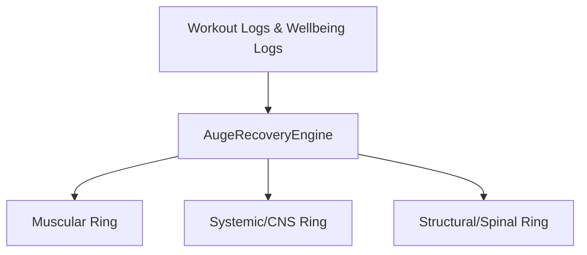

# Technical Mapping: KPKN Fit Android Architecture (For iOS Porting)

This document provides a comprehensive technical mapping of the native Android Kotlin codebase of KPKN Fit. It outlines every system, database table, domain logic engine, screen, and background service to ensure a 100% parity port to iOS (using SwiftUI, Swift Concurrency, SwiftData/CoreData, etc.).

> Source root for everything below: `android-native/app/src/main/java/com/example/kpkn/`
> For the plain directory tree, see [REPO_STRUCTURE.md](REPO_STRUCTURE.md).

---

## 🗂️ 1. General Architecture Stack

*   **Language:** Kotlin 2.2.10 (native Android)
*   **UI Framework:** Jetpack Compose (BOM 2025.07.00, Material 3) + Haze (glassmorphism)
*   **Database:** Room 2.7.1 (SQLite) with FTS4 full-text search — database **version 19**
*   **Concurrency:** Kotlin Coroutines & Flows (reactive UI updates)
*   **Dependency Injection:** Manual constructor injection orchestrated in `MainActivity.kt` (no Hilt/Dagger overhead)
*   **Build:** Single module `:app`; product flavors `base` (minSdk 24) and `health` (minSdk 26, adds Health Connect); `compileSdk 36`, `targetSdk 35`
*   **Extras:** DataStore Preferences, Glance AppWidget, Coil, Kotlinx Serialization, LeakCanary (debug only)
*   **Performance Monitoring:** Android `StrictMode` enabled in debug builds to catch main-thread disk I/O and SQLite leaks

---

## 🗄️ 2. Database Schema & Data Persistence

KPKN Fit uses a **local-first (offline-first)** data architecture. The Room database is defined in `data/db/KpknDatabase.kt` (**version 19**, `exportSchema = false`). Most complex objects are serialized to JSON strings using Kotlinx Serialization and stored directly in a `data` text column.

### 2.1 SQLite Table Definitions

**Core tables (`data/db/Entities.kt`):**

| Table Name | Entity Class | Primary Key | Indices | Serialization Details |
| :--- | :--- | :--- | :--- | :--- |
| `programs` | `ProgramEntity` | `id` (String UUID) | None | Full `Program` struct serialized to JSON string in `data`. |
| `workout_logs` | `WorkoutLogEntity` | `id` (String UUID) | `programId`, `date`, `sessionId` | Serialized `WorkoutLog` JSON string in `data`. |
| `competition_records` | `CompetitionRecordEntity` | `id` (String UUID) | `eventDate`, `status`, `sportType`, `plannedSessionId` | Serialized `CompetitionRecord` JSON string in `data`. |
| `settings` | `SettingsEntity` | `rowId` (Int, default 1) | None | Serialized `Settings` JSON string in `data`. |
| `active_program` | `ActiveProgramEntity` | `rowId` (Int, default 1) | None | Serialized `ActiveProgramState` JSON string in `data`. |
| `ongoing_workout` | `OngoingWorkoutEntity` | `rowId` (Int, default 1) | None | Serialized `OngoingWorkoutState` JSON string in `data` (tracks running session state in case of app crashes). |
| `workout_context_performance` | `WorkoutContextPerformanceEntity` | `contextKey` (String) | None | Serialized `ContextPerformanceStateV2` JSON string. |
| `workout_global_performance` | `WorkoutGlobalPerformanceEntity` | `globalKey` (String) | None | Serialized `GlobalPerformanceStateV3` JSON string. |
| `workout_context_profiles` | `WorkoutContextProfileEntity` | `id` (String) | `exerciseKey`, `lastUsedAt` | Serialized `WorkoutContextProfile` JSON string. |
| `workout_replacement_decisions` | `WorkoutReplacementDecisionEntity` | `id` (String) | None | Serialized `ExerciseReplacementDecisionV2` JSON string. |
| `auge_wellbeing` | `WellbeingEntity` | `id` (String UUID) | `date` | Serialized `DailyWellbeingLog` JSON string (stores manual overrides, sleep hours, DOMS, stress). |
| `auge_sleep` | `SleepLogEntity` | `id` (String UUID) | `date` | Serialized `SleepLog` JSON string. |
| `auge_sleep_extended` | `SleepLogExtendedEntity` | `id` (String UUID) | `date` | Serialized `SleepLogExtended` JSON string. |
| `auge_feedback` | `PostSessionFeedbackEntity` | `logId` (String) | `date` | Serialized `PostSessionFeedback` JSON string (CNS recovery, DOMS levels per muscle). |
| `auge_pending` | `PendingQuestionnaireEntity` | `rowId` (Int, default 1) | None | Serialized `PendingQuestionnaire` JSON string. |
| `auge_adaptive_cache` | `AugeAdaptiveCacheEntity` | `rowId` (Int, default 1) | None | Serialized `AugeAdaptiveCache` JSON string. |
| `nutrition_logs` | `NutritionLogEntity` | `id` (String UUID) | `date` | Serialized `NutritionLog` JSON string. |
| `nutrition_plans` | `NutritionPlanEntity` | `id` (String UUID) | None | Serialized `NutritionPlan` JSON. |
| `nutrition_active_state` | `NutritionActiveStateEntity` | `rowId` (Int, default 1) | None | Tracks active plan UUID. |
| `nutrition_pantry` | `PantryItemEntity` | `id` (String) | None | Serialized `PantryItem` JSON. |
| `nutrition_templates` | `MealTemplateEntity` | `id` (String UUID) | None | Serialized `MealTemplate` JSON. |
| `nutrition_custom_foods` | `CustomFoodEntity` | `id` (String) | `name`, `normalizedName`, `normalizedBrand` | Serialized custom food description and macro details. |
| `session_templates` | `SessionTemplateEntity` | `id` (String) | `sourceType`, `sortOrder`, `createdAt` | Serialized `SessionTemplate` JSON. |
| `custom_exercises` | `CustomExerciseEntity` | `id` (String) | `name` | Serialized `ExerciseMuscleInfo` JSON. |
| `global_foods` | `GlobalFoodEntity` | `foodId` (String) | `name`, `normalizedName`, `normalizedBrand` | Cleaned-up USDA and OpenFoodFacts Chile food data. |
| `global_foods_fts` | `GlobalFoodFtsEntity` | Virtual FTS4 | None | SQLite full-text search content entity pointing to `global_foods`. |
| `learned_resolutions` | `LearnedResolutionEntity` | `id` (String) | `queryKey` (Unique) | Maps raw user voice strings (e.g. "two eggs") to specific food database IDs. |

**WikiLab anatomy tables (`data/db/WikiLabEntities.kt`, DAO in `WikiLabDao.kt`):**

| Table Name | Entity Class | Content |
| :--- | :--- | :--- |
| `muscle_groups` | `MuscleGroupEntity` | Muscle catalog with hierarchy and recovery profiles. |
| `joints` | `JointEntity` | Articular points (shoulder, elbow, knee, hip, ankle, cervical, lumbar). |
| `tendons` | `TendonEntity` | Tendon catalog with recovery status. |
| `movement_patterns` | `MovementPatternEntity` | Biomechanical movement patterns (squat, hinge, push, pull...). |
| `kinetic_chains` | `KineticChainEntity` | Relational chains linking muscles, joints, and tendons. |

**Performance tracking tables (`data/db/PerformanceRangeEntity.kt`, `PerformanceSnapshotEntity.kt` — added in v15):**

| Table Name | Entity Class | Content |
| :--- | :--- | :--- |
| `performance_range` | `PerformanceRangeEntity` | RMS (rep-max spectrum) performance ranges per exercise/context. |
| `performance_snapshot` | `PerformanceSnapshotEntity` | Point-in-time performance snapshots for homologation. |

### 2.2 Repositories (`data/repository/`)

Single source of truth per feature, all backed by Room:

`ProgramRepository`, `AugeRepository`, `AugeMetricsRepository`, `NutritionRepository`, `WikiLabRepository`, `CompetitionRepository`, `SessionTemplateRepository`, `CustomExerciseRepository`, `LearnRepository`.

### 2.3 Advanced Catalogs & JSON Mobility (`data/models/` & `data/db/`)

*   **`DiscomfortCatalog.kt` & `MobilityExerciseCatalog.kt`:** Hardcoded maps used by the Auge Engine to link specific articular pains (e.g., "Knee Pain") to prescriptive mobility routines.
*   **Models:** `Program.kt`, `Session.kt`, `WorkoutLog.kt`, `Settings.kt`, `AugeModels.kt`, `AugeAdaptiveModels.kt`, `NutritionModels.kt`, `CompetitionModels.kt`, `WorkoutV2Models.kt`, `EnergyModels.kt`, `ExerciseMuscleInfo.kt`.
*   **`DatabaseBackupHelper.kt`:** A crucial utility that exports the entire Room database (Workouts, Programs, Settings, Meals) into a portable JSON structure. **For iOS Parity**, the Swift app must be able to ingest this exact JSON format to allow cross-platform user data migration.

### 2.4 Static Database Assets (Pre-populated on App Launch)

Located in `android-native/app/src/main/assets/`:

1.  **`exercise_catalog_v2.json`:** The sole approved exercise runtime asset. It contains 180 parent/specialty definitions, 280 explicit configurations, exact catalog identities, rich muscle/AUGE/biomechanics/programming metadata, and hierarchical chip axes. It is loaded by `data/exercises/ExerciseDatabase.kt` and validated against the approved catalog revision/hash. The former `exercise_database.json` and `exercise_id_aliases.json` are not runtime fallbacks; legacy copies exist only as curation evidence under `catalog/exercises/v2/curation/evidence/legacy/`.
2.  **`wikilab/` (`joints.json`, `kinetic_chains.json`, `movement_patterns.json`, `muscles.json`, `tendons.json` — ~104 KB):** Full relational catalog representing the anatomical connectivity of the human body (imported by `data/WikiLabPrepopulate.kt`).
3.  **`food_data/` (`food.csv` & `food_nutrient.csv`):** Standard USDA database.
4.  **`food_data/off_chile.csv`:** OpenFoodFacts Chile TSV dataset (~53 MB; the whole `food_data/` folder is ~80 MB).

### 2.5 Food Database Import Flow (`data/food/FoodImporter.kt`)

*   **Mechanism:** Parses USDA `foundation_food` rows from `food.csv` + `food_nutrient.csv` (energy IDs `2048`/`2047`/`1008`, plus macro and micronutrient IDs) and OFF Chile rows with declared, coherent nutrition from `off_chile.csv` (column indices: `0`=barcode, `10`=name, `18`=brand, `89`=kcal, `92`=fat, `129`=carbs, `130`=sugar, `146`=fiber, `150`=protein, `156`=sodium).
*   **Text Normalization:** Lowercases, strips accents, removes non-letter characters, and builds search alias arrays (`normalizeSearch` / `encodeAliases`).
*   **Database Pre-population:** Batched transactions (`BATCH_SIZE = 2000`) into the `global_foods` SQLite table during first run.

### 2.6 Additional Data Layer Services

*   **External AI Services (`data/remote/ExternalAiService.kt`):** A remote fallback data provider connecting to Gemini (1.5/2.0), OpenAI (GPT-4o-mini), or DeepSeek. Used specifically for complex semantic parsing of nutrition voice commands if the local heuristic parser fails. DTOs in `AiNutritionModels.kt`.
*   **WikiLab Prepopulation (`data/WikiLabPrepopulate.kt`):** Executes on first launch to parse and relate the anatomical JSONs (joints, tendons, muscles) into the local Room database.
*   **Bundled content loaders:** `data/programs/ProgramTemplates.kt`, `data/sessions/SessionTemplates.kt` (+ models), `data/splits/SplitTemplates.kt`, `data/protocols/ProtocolLibrary.kt`, `data/learn/` (courses/quizzes), `data/wikilab/TrainingConceptsData.kt`.
*   **Voice (`data/voice/VoiceNutritionRecognizer.kt`):** Recognizer pipeline that turns dictated meals into parsed food logs.

---

## 🌀 3. Core Business Logic (Domain Layer)

> All engines below are pure Kotlin (no `android.*` imports) and unit-tested in `app/src/test/domain/`.

### 3.1 AUGE Recovery Engine (`domain/auge/AugeRecoveryEngine.kt`)

This is the central engine that processes user logs to determine readiness. It maintains three main recovery channels (**RINGS**):



#### 1. Muscular Ring (Muscle Battery)
*   **Recovery Profiles:** Each muscle is assigned a recovery speed profile (`fast` = 24.0h, `medium` = 48.0h, `slow` = 72.0h, `heavy` = 96.0h).
*   **Mathematical Model (Exponential Decay):**
    *   $k = \frac{2.9957}{\text{realRecoveryTime}}$
    *   $\text{Fatigue} = \sum (\text{setStress} \times \text{roleMultiplier} \times \text{volumeActivation}) \times e^{-k \times \text{sigmoidalHoursSinceWorkout}}$
    *   $\text{MuscleBattery} = 100.0 - \text{FatiguePenalty}$
*   **Modifier Adjustments:**
    *   Age: If age $> 35$, recovery time increases by $1\%$ per year.
    *   Gender: Females have recovery time scaled by $0.85$ due to faster local muscular recovery characteristics.
    *   Discomforts: Spinal/Joint issues add a scaling penalty factor up to $+30.0$ fatigue.
    *   DOMS Cap: Hard caps on score based on user self-report (Level $5 \rightarrow$ max $20\%$ battery, Level $4 \rightarrow$ max $50\%$, Level $3 \rightarrow$ max $85\%$).

#### 2. Systemic Ring (Central Nervous System Battery)
*   **Recovery Duration:** Base recovery constant $\tau = 36.0$ hours.
*   **Gym Stress:** Calculates fatigue accumulation using set weights, reps, and RPE:
    *   If RPE $\geq 9.5$ and reps $\leq 3$, CNS drain increases by $+15\%$.
    *   Session duration $> 90$ minutes scales systemic drain by $1.15\times$.
*   **Exponential Decay:** CNS fatigue decays over time with $\tau$ (tau hours). CNS Battery $= 100.0 - \text{normalizedSystemicFatigue}$.

#### 3. Structural Ring (Spinal Battery)
*   **Spine Protection Factor (SPF):** Calculates spinal bracing capacity based on surrounding muscle batteries:
    *   $\text{SPF} = (\text{Erectores} \times 0.50) + (\text{Core} \times 0.25) + (\text{Gluteos} \times 0.15) + (\text{Dorsales} \times 0.10)$
*   **Spinal Bracing Failure Penalty:** If $\text{SPF} < 80.0$, spinal recovery time is amplified:
    *   $\text{SpinalRecoveryMult} = 1.0 + (\text{Deficit}^2 \times 0.75)$
*   **TTC (Time to Recovery):** Converts decay time back to remaining hours before the battery reaches $90\%$ (implemented in `AugeTtcEngine.kt`).

#### 4. Articular Battery & Tendon Imbalances
*   Articular points tracked: `SHOULDER`, `ELBOW`, `KNEE`, `HIP`, `ANKLE`, `CERVICAL`, `LUMBAR` (via `ExerciseReadinessEngine.kt`).
*   Alerts user if there is a severe gap between muscle strength capacities and tendon recovery statuses (`TendonImbalanceAlert`), suggesting biomechanical or nutritional compensations.

#### 5. Supporting AUGE Engines (`domain/auge/`)
*   `AugeAdaptiveEngine.kt` — learns from user feedback to adapt recovery curves (`auge_adaptive_cache` table).
*   `AugeFatigueEngine.kt` — per-set stress and fatigue math.
*   `InterferenceEngine.kt` — structural muscle interference between exercises.
*   `DiscomfortAggregationEngine.kt` — aggregates logged discomforts into penalties.
*   `NutritionRecoveryEngine.kt` — nutrition's contribution to recovery.
*   `SessionIntensityEngine.kt` / `SessionMuscleFilter.kt` / `AugeClassifiers.kt` / `AugeMuscleNormalization.kt` / `ExerciseFatigueIndex.kt` / `AugeUtils.kt`.

### 3.2 Nutrition Engine (`domain/nutrition/`)

*   **Macro Calculators (`MacroCalculator.kt`):** Energy formula: $\text{Calories} = (\text{Protein} \times 4.0) + (\text{Carbs} \times 4.0) + (\text{Fats} \times 9.0)$. Checks for deviation thresholds (default $5\%$) via `MacroValidator.kt`.
*   **Heuristic Parser (`FoodParser.kt` + `data/food/FoodDescriptionParser.kt`):** Takes natural user input (e.g. "platano con una cucharada de avena") and breaks it down:
    *   Checks for cooking methods (boiled, fried, baked) and applies specific calorie scaling factors (`CookingFactors.kt`, `CookingMethodParser.kt`).
    *   Extracts quantities and maps subjective words ("taza", "unidad", "rebanada", "plato") to raw grams using `SubjectivePortionEngine.kt` (+ `SemanticPortionRetriever.kt`).
    *   Fuzzy match database queries using phonetic index codes in Spanish (`PhoneticEs.kt`), `TextNormalizer.kt`, `FoodIndex.kt`, `SmartFoodResolver.kt`, `FoodCombinationParser.kt`.
    *   Offline semantic dataset: compiled asset `food_data/dataset_knowledge.bin` (19,405 examples) loaded by `DatasetKnowledgeStore.kt` into `SemanticPortionRetriever.kt`; context priors via `ContextDetector.kt`. Fallback: `NutritionHeuristicEstimator.kt`. Dataset never overwrites verified USDA/OFF macros.

### 3.3 Training Engine (`domain/training/`)

*   **`LoopEngine.kt`:** Implements the routine progression engine, managing set types (Normal, Warmup, Drop-set, Myo-reps, Failure) and tracking target volume metrics.
*   **`VolumeCalculator.kt`:** Weekly/per-muscle volume analytics.
*   **`ProgramCalendarEngine.kt` / `ProgramAnalyticsEngine.kt` / `ProgramDetailHelpers.kt`:** Microcycle calendar and program analytics.
*   **`SplitApplicationEngine.kt`:** Applies weekly split templates to programs.
*   **Plate Calculator (`domain/calculations/PlateCalculator.kt`):** Solves a linear matching problem to determine exactly which weight plates to put on each side of the barbell for any given target weight (e.g. using 20kg, 15kg, 10kg, 5kg, 2.5kg, 1.25kg plates, assuming a 20kg barbell).

### 3.4 Workout Engines (`domain/workout/`)

*   **`SupersetRules.kt`:** Validation and rules for superset/drop-set bundling.
*   **`WorkoutContextRecurrenceEngine.kt`:** Detects recurring context patterns for autofill.
*   **`WorkoutPerformanceHomologationEngine.kt`:** Homologates performance across contexts (V2 performance system, backed by `performance_range` / `performance_snapshot` tables).

### 3.5 Exercise Intelligence (`domain/exercises/`)

*   **`ExerciseIdentity.kt` / `ExerciseMatchEngine.kt`:** Canonical identity and fuzzy matching of exercises.
*   **`ExerciseMuscleResolver.kt` / `ExerciseAnatomy.kt`:** Resolves involved muscles and anatomy per exercise.
*   **`VariantGroupIndex.kt` / `VariantPreferenceStore.kt`:** Exercise variant grouping and user preferences.
*   **`ExerciseCatalogInsights.kt` / `ExerciseFilters.kt` / `TechnicalAspectEngine.kt` / `ExerciseAugeInference.kt`.**

### 3.6 Session Assistant Engine (`domain/sessionassistant/SessionAssistantEngine.kt`)

*   **Smart Session Parsing:** Analyzes an active session's parameters (volume, predicted muscular drain, rest times).
*   **Time Optimization Suggestions:** If a session exceeds the user's target duration, the engine generates actionable suggestions such as:
    *   Reducing rest times between sets.
    *   Converting linear sets into Supersets (pairing antagonistic muscles) or Drop-sets.
    *   Dropping lower-priority auxiliary volume.

### 3.7 Biomechanics Engine (`domain/biomechanics/BiomechanicsEngine.kt`)

*   **Lever Classification:** Evaluates joint angles to classify movements into First, Second, and Third-class levers.
*   **Stickman Model:** Uses anthropometric ratios (femur length, torso length, arm span) to calculate moments of force (torques) for specific lifts (e.g., comparing High-Bar vs Low-Bar squats based on the user's femur/torso ratio).

### 3.8 Supporting Domain Packages

*   **`domain/energy/TrainingEnergyEngine.kt`:** Energy system modeling for sessions.
*   **`domain/performance/PerformanceRangeCalculator.kt`:** RMS performance range math.
*   **`domain/templates/SessionTemplateEngine.kt` (+ `SessionTemplateCatalogPolicy.kt`):** Template generation and catalog policy.

---

## 📱 4. UI Presentation Layer & Screens

The app UI is written in Jetpack Compose, organized by feature under `screens/` (each feature typically pairs `FooScreen.kt` with `FooViewModel.kt`, with sub-composables in a local `components/` folder):

```
screens/
├── home/                 # Main Dashboard (RINGS UI) + sections (Header, Rings, Session,
│                         #   Cards, Corners, Programs, WikiLab, CreateProgramCard)
├── auge/                 # AUGE details: ReadinessSheet, PostExerciseSheet, PostSessionSheet
├── workout/              # Live Session tracker, rest timer, plate visualizer, voice UI
│                         #   (+ components/: SetExecutionCard, rest overlays, roadmap bar...)
├── nutrition/            # Macro dashboard + MealHistoryScreen + BodyProgressScreen
│                         #   (+ components/: FoodLoggerDrawer, wizard, plan editor)
├── programs/             # Program list (Active & History)
├── programdetail/        # Microcycle calendar & volume charts
├── sessioneditor/        # Supersets/Target editor + rules engine
├── settings/             # Hub + General/Profile/Nutrition/Training/Auge/Notifications/Data
├── wikilab/              # Anatomy explorer: muscles, joints, tendons, patterns,
│                         #   biomechanics, exercise detail, custom exercise creator
├── learn/                # Courses: LearnHome, Course, Reader, Quiz, Badge screens
├── profile/              # User stats
└── competitions/         # Leaderboards
```

### 4.1 The "My Rings" System (Home Screen)

The home dashboard centers around **three concentric recovery rings** representing the three AUGE batteries:

1.  **Outer Ring (Green/Red):** Muscular Battery (overall muscle system readiness).
2.  **Middle Ring (Blue):** CNS Battery (neurological/energy readiness).
3.  **Inner Ring (Orange/Purple):** Spinal Battery (structural readiness).

*   **Readiness Sliders:** Located on the home page or settings, allowing users to manually drag and override their current neural/muscular/spinal battery if they feel better or worse than the calculated metric. Manual overrides anchor the engine decay formulas at that specific timestamp.

### 4.2 Screens Description

1.  **`home` (Dashboard):** Shows the RINGS, daily workout targets, active program quick launcher, and a daily wellbeing questionnaire.
2.  **`auge` (Recovery Detail):** Readiness verdicts (GREEN/YELLOW/RED), articular breakdown, and post-exercise/post-session questionnaire sheets with 1-5 DOMS sliders.
3.  **`workout` (Live Session):** Live tracker displaying sets in progress. It incorporates rest timer alarms, Text-To-Speech audio guides (announcing sets, weight, and RPE), and **automatic weight adjustment suggestions** (if fatigue is too high, it prompts the user to reduce weight for the next set). Pre-workout `ReadinessGateScreen` verifies recovery before starting.
4.  **`sessioneditor`:** Interface for creating splits, sequencing exercises, and bundling exercises into supersets or drop-sets.
5.  **`nutrition`:** Displays macro bars (Protein, Carbs, Fats) and a log of meals. Includes a quick-add drawer (`FoodLoggerDrawer`), search with FTS4, a **Voice Dictation Bar**, meal history, body progress tracking, and a plan wizard.
6.  **`wikilab`:** Interactive anatomical explorer divided into muscles, joints, tendons, and movement patterns, plus biomechanics visuals and a custom exercise creator.
7.  **`settings`:** Hub screen with subscreens: General, Profile, Nutrition, Training, AUGE, Notifications, and Data (backup). Includes manual battery override sliders, theme controls, and haptic switches.
8.  **`learn`:** Guided education: course list, reader, quizzes, and badge rewards.
9.  **`competitions` / `profile`:** Leaderboards and user stats.

### 4.3 Navigation & Routing (`navigation/`)

*   **`Navigation.kt`:** Declares all `KpknRoute` objects and the `NavHost`. Main tabs: `home`, `training`, `nutrition`, `wikilab`. Parameterized routes include `program/{programId}`, `session-editor/{programId}/{sessionId}`, `workout/{programId}/{sessionId}`, `readiness-gate/...`, `competition/{competitionId}`, `settings/<sub>`, `wikilab/<...>` (muscles/joints/tendons/patterns/chains/exercises/concepts/biomechanics), `nutrition/<wizard|body-progress|meal-history|action/{action}>`, `learn/<...>`, and `settings/health-connect` (health flavor only).
*   **`DeepLinkRouter.kt` / `KpknDeepLinks.kt`:** URL scheme handler for `kpkn://` and `https://kpkn.fit` (declared in the manifest), pushing routes into the `NavHost` (used by notifications and widgets).
*   **`NavigationBus.kt`:** Decoupled in-app navigation events.

### 4.4 Design System & Theming (`ui/theme/`)

*   **High Contrast Dark Mode:** The app deliberately eschews standard Material colors for an aggressive, premium dark mode (`Color.kt`, `Theme.kt`, `Type.kt`).
*   **Color Palette:** Pitch black backgrounds (`#000000`), accented strictly by neon highlight colors: Neon Yellow (Primary), Neon Cyan (Secondary), and Magenta (Tertiary). Text is high-contrast white. Swift parity should enforce these exact RGB values globally.
*   **Extras:** Haze glassmorphism effects, custom icon set in `ui/components/icons/`, ES/EN strings via `ui/locale/LocaleManager.kt`.

---

## 🎙️ 5. Services & Hardware Integration

### 5.1 Continuous Voice Logging System (`services/workout/`)

*   **`WorkoutContinuousVoiceEngine.kt`:** Local Vosk engine running in the separate `:voice` process. A single actor owns `AudioRecord` (16 kHz) + a Vosk `Recognizer` with **restricted grammars per stage** (folded phrases the recognizer can emit), plus a native one-shot on-device fallback. Auto-recovery of capture with backoff.
*   **IPC (`WorkoutVoiceForegroundService` + `WorkoutRemoteVoiceEngineClient`):** the `:voice` process is a foreground service (type `microphone`) accessed over AIDL; the client keeps monotonic generations, a `DeathRecipient` and a heartbeat.
*   **Command Parsing (`WorkoutVoiceCommandParser.kt` + `WorkoutVoiceController.kt`):** Parses Spanish voice triggers in a live session, e.g.:
    *   "ochenta kilos por ocho RPE 7", "me quedaron dos en reserva", "dándolo todo"
    *   "siguiente ejercicio", "omitir descanso", "añade una serie"
    *   "cuánto drenaje llevo", "qué serie voy", "qué lado falta"
*   **Auto-recovery ("fénix", `WorkoutVoiceRecoveryPolicy` + controller):** if the `:voice` process dies or hangs, the session reconnects with backoff (0/1/2/5/10/30 s) and re-asks a pending confirmation once; the model is never unloaded during a session.
*   **`WorkoutVoiceSessionState.kt` / `WorkoutVoicePermissionHelper.kt` / `PermissionGuideHelper.kt`:** Session state machine and permission UX.

### 5.2 Workout Rest Foreground Service (`services/workout/WorkoutRestForegroundService.kt`)

*   An Android `Service` marked `foregroundServiceType="dataSync"` in the manifest.
*   Keeps the active workout timer running and updates notifications when the app is in the background.
*   Rest alerts (`WorkoutRestAlertManager.kt` + `WorkoutRestAlertRules.kt`) and media-button handling from locked screens (`TimerNotificationActionReceiver`).
*   **`ActiveWorkoutHolder.kt`:** Process-wide holder of the running session.

### 5.3 Audio & TTS Subsystem (`services/workout/`)

*   **`WorkoutTtsManager.kt`:** Uses Android's `TextToSpeech` engine to narrate rest periods, targets ("Log 80 kilos for 8 reps"), and encouragements.
*   **`SystemAudioHelper.kt`:** Manages Audio Focus, ensuring that background music (e.g., Spotify) is "ducked" (volume lowered) when the TTS speaks or when the rest timer alarm rings.

### 5.4 Home Widgets (`widgets/NutritionQuickActionWidget.kt`)

*   Glance-based `AppWidgetProvider` (`NutritionQuickActionWidgetReceiver` in the manifest).
*   Exposes circular progress rings on the Android launcher screen, showing protein and calorie progress at a glance, with quick launch buttons to log water or open voice search.

---

## 📋 6. Auxiliary Systems (Telemetry, Routing, Notifications)

### 6.1 Telemetry & Analytics (`telemetry/`)

*   **`KpknTelemetry.kt` / `TelemetryEvents.kt` / `TelemetryHelper.kt`:** A custom analytics wrapper that records user flows (e.g., workout completion rates, feature usage).

### 6.2 Deep Linking (`navigation/`)

*   See §4.3 — `kpkn://` and `https://kpkn.fit` schemes plus `SEND` text/plain intent handling in `MainActivity`.

### 6.3 Local Alarm & Notification Managers

*   **`services/nutrition/NutritionNotificationManager.kt`:** Schedules meal reminders (`NutritionAlertReceiver`).
*   **`services/workout/WorkoutReminderManager.kt`:** Schedules workout-day reminders (`WorkoutReminderReceiver`).
*   **`services/workout/WorkoutReminderBootReceiver.kt`:** A `BroadcastReceiver` (exported, `BOOT_COMPLETED` + `MY_PACKAGE_REPLACED`) that re-registers all alarms if the Android device is rebooted.
*   **`services/competition/CompetitionReminderManager.kt`:** Competition reminders (`CompetitionReminderReceiver`).
*   **`LoopNotificationManager.kt`:** In-session loop notifications.

### 6.4 Manifest-declared Components

*   Application class: `.KpknApplication`; single exported activity: `.MainActivity`.
*   Permissions: `INTERNET`, `RECORD_AUDIO`, `POST_NOTIFICATIONS`, `SCHEDULE_EXACT_ALARM`, `FOREGROUND_SERVICE(_DATA_SYNC)`, `WAKE_LOCK`, `VIBRATE`, `RECEIVE_BOOT_COMPLETED`.
*   `FileProvider` (`${applicationId}.fileprovider`) for sharing files (e.g. backups, workout shares via `WorkoutShareService.kt`).
*   `android:largeHeap="true"` (the ~80 MB food dataset import requires it).

---

## 🧪 7. Testing Layout

*   **Unit tests (`app/src/test/`, JUnit 4 + Robolectric + kotlinx-coroutines-test):** Mirrors the main package tree. Heaviest coverage in `domain/` (AUGE engines, nutrition parsers, training/workout engines), plus `data/` (database load, serialization), `screens/` (ViewModel and rules tests for workout/session editor/program detail/nutrition), `services/workout/`, `navigation/DeepLinkRouterTest.kt`, and `telemetry/`.
*   **Instrumented (`app/src/androidTest/`):** Compose UI test scaffolding (espresso + compose-ui-test).

---

## 🍏 8. Key Parity Guidelines for iOS (Swift)

For the Swift implementation (`ios-native/KPKNFit/`), use the following technology mapping:

| Android Native System (Kotlin) | iOS Native Parity System (Swift) |
| :--- | :--- |
| **Room Database** | **SwiftData** (using `@Model` macro) or **CoreData** (with custom SQLite indexes and FTS5). |
| **FTS4 Virtual Tables** | **FTS5** virtual table in SQLite database via SQLite.swift. |
| **Coroutines & Flows** | **Swift Concurrency** (`Task`, `async/await`) & `AsyncStream` / `Combine`. |
| **SpeechRecognizer** | **Speech framework** (`SFSpeechRecognizer`) with a continuous audio buffer. |
| **Foreground Service** | **Live Activities** & **ActivityKit** (to display workout timer on Lock Screen and Dynamic Island). |
| **AppWidgetProvider (Glance)** | **WidgetKit** (using SwiftUI layouts). |
| **TextToSpeech** | **AVFoundation** (`AVSpeechSynthesizer`). |
| **Jetpack Compose** | **SwiftUI** (using grids, custom canvas paths for Rings). |
| **DataStore Preferences** | **`@AppStorage` / UserDefaults**. |
| **Health Connect (flavor `health`)** | **HealthKit**. |
