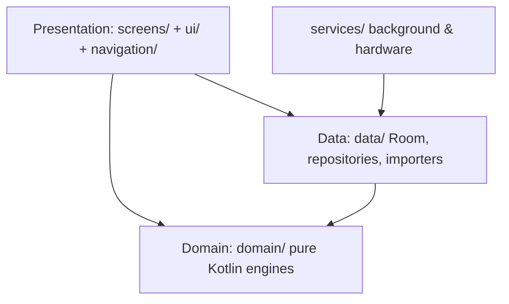

# Architecture Guide: KPKN Fit Android App

KPKN Fit is a local-first mobile application written in **native Kotlin** for Android. The architecture follows **Clean Architecture** and **MVVM** to guarantee separation of concerns, offline functionality, testability, and scalability.

> For the full directory tree see [REPO_STRUCTURE.md](REPO_STRUCTURE.md). For exhaustive system/table-level mapping see [ANDROID_ARCHITECTURE_MAP.md](ANDROID_ARCHITECTURE_MAP.md).

---

## 🏗️ Architectural Layers

All app code lives under `android-native/app/src/main/java/com/example/kpkn/` (single Gradle module `:app`, 260+ Kotlin files):

**Dependency rule:** `domain/` never imports `android.*`. All persistence, I/O, and framework code lives in `data/`, `services/`, or the presentation layer.

### 1. Data Layer (`data/`)

Responsible for persistence, local assets, and remote calls.

*   **Room Database (`data/db/`):**
    *   `KpknDatabase.kt` — single database, **version 23**, entities + JSON blobs.
    *   Entities: `Entities.kt`, `WikiLabEntities.kt`, `PerformanceRangeEntity.kt`, `PerformanceSnapshotEntity.kt`. Complex models (`Program`, `Settings`, …) are serialized to JSON strings (Kotlinx Serialization) in a `data` column — **no Room migration** when only adding optional JSON fields.
    *   DAOs: `Daos.kt`, `WikiLabDao.kt`. FTS4 virtual table (`global_foods_fts`) powers food search.
    *   **Offline-First:** every read/write passes through Room; network sync is a secondary concern.
    *   `DatabaseBackupHelper.kt` — full-database JSON export/import (used for cross-platform migration and user backups).
*   **Repositories (`data/repository/`):** Single source of truth per domain: `ProgramRepository`, `AugeRepository`, `AugeMetricsRepository`, `NutritionRepository`, `WikiLabRepository`, `CompetitionRepository`, `SessionTemplateRepository`, `CustomExerciseRepository`, `LearnRepository`.
*   **Models (`data/models/`):** Serializable domain models (`Program`, `Session`, `WorkoutLog`, `Settings`, `AugeModels`, `AugeAdaptiveModels`, `NutritionModels`, `CompetitionModels`, `WorkoutV2Models`, `EnergyModels`) plus hardcoded catalogs (`DiscomfortCatalog`, `MobilityExerciseCatalog`).
*   **Static content loaders:** `exercises/ExerciseDatabase.kt`, `food/FoodDatabase.kt` + `food/FoodImporter.kt` (USDA + OpenFoodFacts Chile prepopulation, batched transactions), `WikiLabPrepopulate.kt` (anatomy JSONs → Room), `programs/`, `sessions/`, `splits/`, `protocols/`, `learn/`, `wikilab/` (bundled templates and content).
*   **Remote (`data/remote/`):** `ExternalAiService.kt` — optional AI fallback (Gemini / OpenAI / DeepSeek) for hard nutrition parsing cases; `AiNutritionModels.kt` DTOs.
*   **Voice (`data/voice/`):** `VoiceNutritionRecognizer.kt` — speech-to-food-log pipeline feeding the nutrition domain engines.

### 2. Domain Layer (`domain/`)

Pure Kotlin business logic with zero Android dependencies — the most heavily tested code in the repo (`app/src/test/domain/`).

*   **AUGE Recovery System (`domain/auge/`):** `AugeRecoveryEngine` (three battery rings: muscular, CNS, spinal), `AugeFatigueEngine` (exponential decay per muscle), `AugeTtcEngine` (time-to-recovery), `InterferenceEngine` (structural muscle interference), `ExerciseReadinessEngine` (articular readiness), `AugeAdaptiveEngine`, `DiscomfortAggregationEngine`, `NutritionRecoveryEngine`, `SessionIntensityEngine`, plus classifiers and utilities.
*   **Nutrition Engine (`domain/nutrition/`):** `FoodParser`, `SmartFoodResolver`, `TextNormalizer`, `PhoneticEs` (Spanish phonetics), `SubjectivePortionEngine` ("media taza" → grams), `MacroCalculator`/`MacroValidator`, cooking-method factors, dataset knowledge.
*   **Training (`domain/training/`):** `LoopEngine`, `VolumeCalculator`, `ProgramCalendarEngine`, `ProgramAnalyticsEngine`, `SplitApplicationEngine`, `PeriodizationEngine`, `BlockProgressionEngine` (prescripción semanal por bloque), `BlockTransitionEngine` (avance / deload AUGE / test 1RM), `ProgramProgressEngine` (SIMPLE + COMPLEX).
*   **Workout (`domain/workout/`):** `SupersetRules`, `WorkoutContextRecurrenceEngine`, `WorkoutPerformanceHomologationEngine` (V2 performance tracking).
*   **Exercises (`domain/exercises/`):** `ExerciseIdentity`, `ExerciseMatchEngine`, `ExerciseMuscleResolver`, `ExerciseAnatomy`, variant grouping/preference, catalog insights and filters.
*   **Session Assistant (`domain/sessionassistant/`):** `SessionAssistantEngine` — suggests rest reductions, supersets, or volume cuts when a session exceeds its target duration.
*   **Biomechanics (`domain/biomechanics/`):** `BiomechanicsEngine` — lever classification, anthropometric torque analysis.
*   **Supporting packages:** `calculations/` (`PlateCalculator` — barbell plate layout), `energy/` (`TrainingEnergyEngine`), `performance/` (`PerformanceRangeCalculator`), `templates/` (`SessionTemplateEngine`).

### 3. Presentation Layer (`screens/`, `ui/`, `navigation/`)

*   **Jetpack Compose UI:** Single `MainActivity` hosting a `NavHost` and bottom navigation. Feature packages under `screens/`: `home`, `workout`, `nutrition`, `programs`, `programdetail`, `sessioneditor`, `settings`, `auge`, `wikilab`, `learn`, `profile`, `competitions`. Larger features keep sub-components in a local `components/` folder.
*   **ViewModels & UDF:** Each screen pair (`FooScreen.kt` + `FooViewModel.kt`) follows unidirectional data flow — user events → ViewModel → immutable `StateFlow` → recomposition. ViewModels expose read-only `StateFlow` (`asStateFlow()`); mutable state never leaks to the UI.
*   **Navigation (`navigation/`):** `Navigation.kt` declares all `KpknRoute` routes and the `NavHost`; `DeepLinkRouter`/`KpknDeepLinks` handle `kpkn://` and `https://kpkn.fit` links; `NavigationBus` decouples cross-feature navigation.
*   **Design system (`ui/`):** `ui/theme/` (Color/Theme/Type — pitch-black + neon yellow/cyan/magenta), `ui/components/` (shared composables, custom icons), `ui/locale/LocaleManager.kt` (ES/EN). Glassmorphism via the Haze library.
*   **Dependency Injection:** Manual constructor injection, wired in `MainActivity.kt` (no Hilt/Dagger).

### 4. Services & Hardware (`services/`)

*   **`services/workout/`:** `WorkoutRestForegroundService` (keeps timer/rest alive in background), the continuous voice system — `WorkoutContinuousVoiceEngine` (Vosk, restricted grammars) + `WorkoutVoiceController`/`WorkoutVoiceCommandParser` (Spanish commands, live session), `WorkoutTtsManager` (audio cues), `WorkoutVoiceForegroundService` (foreground owner of Vosk in the separate `:voice` process over AIDL), auto-recovery ("fénix", `WorkoutVoiceRecoveryPolicy`), `WorkoutRestAlertManager`, `WorkoutReminderManager` + `WorkoutReminderBootReceiver` (alarm re-registration after reboot), `LoopNotificationManager`, `SystemAudioHelper` (audio-focus ducking), permission helpers.
*   **`services/nutrition/`:** `NutritionNotificationManager` (meal reminders via `AlarmManager`).
*   **`services/competition/`:** `CompetitionReminderManager`.
*   **App Widget (`widgets/`):** `NutritionQuickActionWidget` — Glance-based home-screen macro rings.
*   **Telemetry (`telemetry/`):** `KpknTelemetry`, `TelemetryEvents`, `TelemetryHelper` — lightweight in-app analytics.

### 5. App Entry Points

| Component | File | Role |
| :--- | :--- | :--- |
| Application | `KpknApplication.kt` | Process bootstrap (StrictMode in debug). |
| Activity | `MainActivity.kt` | Compose host, NavHost, bottom nav, DI wiring. |
| Manifest | `AndroidManifest.xml` | Permissions (audio, notifications, alarms, boot), foreground service, receivers, deep links, `FileProvider`. |
| Flavors | `app/build.gradle.kts` | `base` (minSdk 24) and `health` (minSdk 26, adds Health Connect). |

---

## ⚡ Core Technical Principles

1.  **Offline-First:** All writes go to Room first. AI/network features degrade gracefully when offline.
2.  **Coroutines everywhere:** Disk/network on `Dispatchers.IO`, UI state on `Dispatchers.Main`; reactive updates via `Flow`/`StateFlow`.
3.  **Uni-directional Data Flow:** Events → ViewModel → `StateFlow` → Compose recomposition.
4.  **Immutability:** `val` + `data class` by default; `var` only when mutation is strictly required.
5.  **Testability:** Domain engines are pure Kotlin and covered by unit tests in `app/src/test/` (JUnit 4 + Robolectric + kotlinx-coroutines-test).
