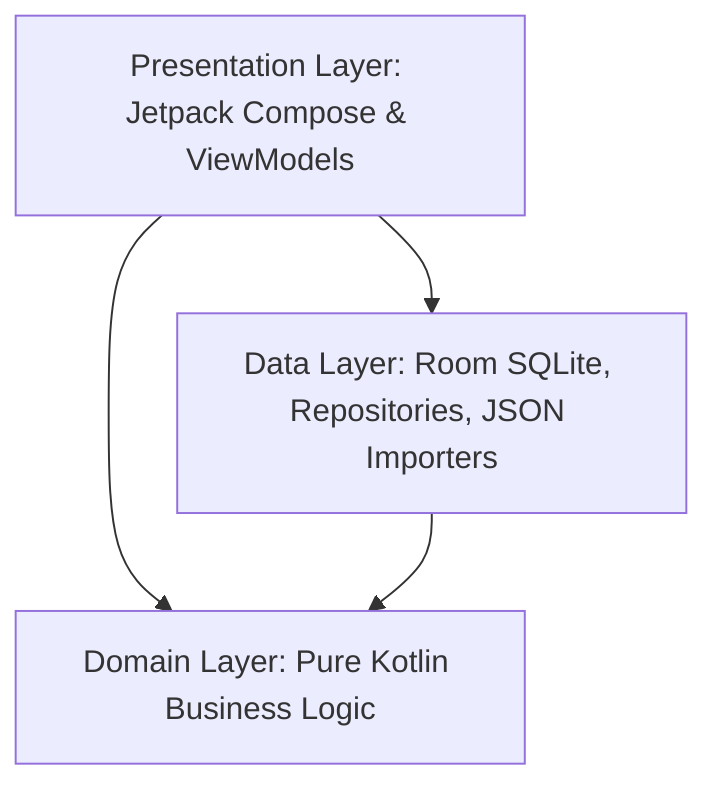

# Architecture Guide: KPKN Fit Android App

KPKN Fit is a local-first mobile application written in **native Kotlin** for Android. The architecture is designed around **Clean Architecture** and **MVVM (Model-View-ViewModel)** patterns to ensure high separation of concerns, off-line functionality, testability, and scalability.

---

## 🏗️ Architectural Layers

The app is divided into three primary layers located under `android-native/app/src/main/java/com/example/kpkn/`:

### 1. Data Layer (`com.example.kpkn.data`)
Responsible for data persistence, local storage, remote API calls, and local asset importing.
*   **Local Persistence (Room Database):** 
    *   Defined in `data/db/KpknDatabase.kt`.
    *   Entities live in `Entities.kt` and `WikiLabEntities.kt` (using immutable `data class` with type converters).
    *   DAOs live in `Daos.kt` and `WikiLabDao.kt`.
    *   Implements an **Offline-First** pattern: writes and reads always pass through Room before syncing with backend APIs (e.g. Supabase).
*   **Local Assets Importer:**
    *   Pre-populates database tables for exercises (`WikiLabPrepopulate.kt`) and food databases (`FoodImporter.kt` / `FoodDatabase.kt`) using large JSON datasets in `/data`.
*   **Repositories:**
    *   Act as the single source of truth for the rest of the application, managing transitions between databases and network requests.

### 2. Domain Layer (`com.example.kpkn.domain`)
The heart of the application containing pure Kotlin business rules and calculations. It has zero dependencies on Android UI frameworks, making it highly testable.
*   **AUGE Adaptive Engine (`domain/auge/`):**
    *   Calculates systemic fatigue (`AugeFatigueEngine`), target time-to-recovery (`AugeTtcEngine`), muscle interference (`InterferenceEngine`), and joint/articular readiness (`ExerciseReadinessEngine`).
*   **Nutrition Engine (`domain/nutrition/`):**
    *   Parses user descriptions using phonetic mapping and heuristics (`FoodParser`, `TextNormalizer`, `SmartFoodResolver`).
    *   Calculates macronutrient values and translates subjective portion descriptions (e.g., "half a plate", "one cup") to grams (`SubjectivePortionEngine`).
*   **Training & Biomechanics (`domain/training/`, `domain/biomechanics/`):**
    *   Analyzes workout volumes (`VolumeCalculator`), plate layouts (`PlateCalculator`), and exercises (`ExerciseAnatomy`).

### 3. Presentation Layer (`com.example.kpkn.screens`, `com.example.kpkn.ui`, `com.example.kpkn.navigation`)
Responsible for rendering user interfaces and handling UI-related state.
*   **Jetpack Compose:** Declarative UI layouts using custom Compose canvases, components, and responsive themes (`com.example.kpkn.ui`).
*   **ViewModels & StateFlow:** Screens consume state reactively via ViewModels exposing Kotlin `StateFlow`/`SharedFlow`. ViewModels orchestrate calls to the Repository layer.
*   **Navigation:** Managed declaratively using custom Compose navigation graphs (`com.example.kpkn.navigation`).

### 4. Services Layer (`com.example.kpkn.services`)
Manages hardware interfaces and background tasks.
*   **Voice Logging Engine (`services/workout/WorkoutContinuousVoiceEngine.kt`):**
    *   Implements continuous background voice recognition to allow hands-free logging during heavy lifts.
    *   Processes spoken commands using custom parser structures (`WorkoutVoiceCommandParser`).
*   **Text-to-Speech (TTS):** Provides audio cues for rests and set transitions.
*   **Active Workout Foreground Service:** Ensures the active workout timer and rest alerts stay alive even if the app is minimized.

---

## ⚡ Core Technical Principles

1.  **Offline-First Strategy:**
    *   All write operations are saved locally first. Network synchronization is treated as a secondary background task.
2.  **Concurrency via Coroutines:**
    *   Asynchronous operations use Kotlin Coroutines. Disk and network calls are confined to `Dispatchers.IO`, while UI state flows are updated on `Dispatchers.Main`.
3.  **Uni-directional Data Flow (UDF):**
    *   User interactions trigger events in ViewModels $\rightarrow$ ViewModels update state flows $\rightarrow$ Jetpack Compose screens recompose based on state changes.
