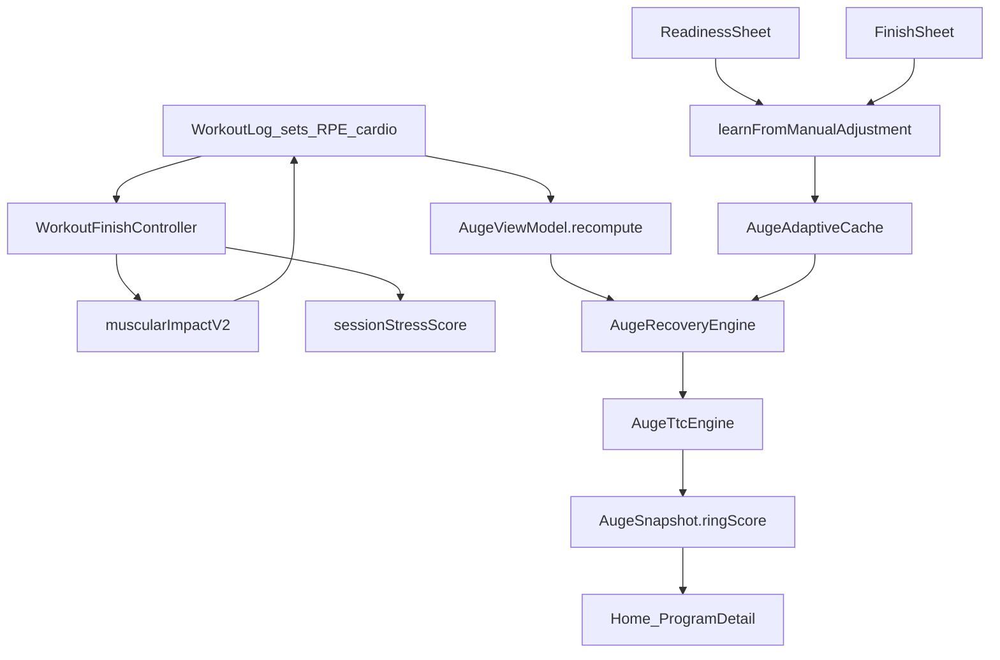
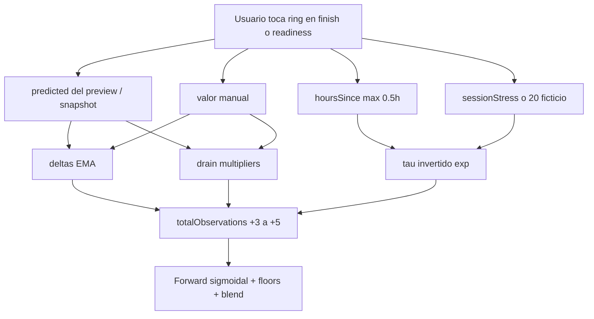

# Auditoría completa RINGS/AUGE

- **Fecha:** 2026-08-29
- **Alcance:** runtime Android (`domain/auge/`, `AugeViewModel`, Home, Workout readiness/finish, editor, voz, Room). Claims de backend solo como contraste. iOS fuera.
- **Tipo:** solo lectura. No se editó producto.
- **Tests de caracterización:** `BUILD SUCCESSFUL` — `AugeRingDrainRealismTest`, `OvernightRecoverySensationTest`, `AugeEditorCompletedParityTest`, `SessionDrainBoundsTest`, `AdaptiveCalibrationAppliesTest`, `AugeAdaptiveEngineTest`, `CardioRingDrainBoundsTest`.

---

## 1. Resumen ejecutivo

AUGE en Android **sí está cableado**. El loop vivo es: historial de series → recálculo de baterías (no se persiste el %) → Home/Workout leen `ringScore` → el usuario calibra en el sheet de readiness y, si quiere, al cerrar la sesión. Eso coincide con el producto actual.

El sistema **no es una medición fisiológica**. Es un modelo de carga (catálogo EFC/CNC/SSC × RPE × volumen × decaimiento) más la sensación del usuario. Eso puede ser un buen producto si el copy lo nombra así. Deja de serlo cuando el texto vende “estado del cuerpo”, “algoritmo que mejora solo” o “colágeno ~10%”.

**Veredicto de fiabilidad:** los rings automáticos sirven para **orientar carga reciente**. No sirven, tal como están, para decidir “hoy no entrenes” o “tus tendones necesitan colágeno” como si fueran un laboratorio. El riesgo más grave no es un feature faltante: es que **un toque de calibración puede enseñar tres parámetros a la vez, con un reloj falso de 30 minutos**, y dejar el modelo más torcido que antes.

---

## 2. Decisiones de producto (no son gaps)

Estas ausencias **no se puntúan como fallo** y **no se propone reabrirlas**.

| Decisión | Qué significa | Residual que sí se reporta |
|----------|---------------|----------------------------|
| Sin feedback 24h | Redundante con readiness vivo | Copy de Home aún promete “al día siguiente” |
| Sin Sleep AUGE | Se mide estructura (SNC), no el hábito (horas) | El motor aún aplica `sleepMult` con fallback 7.5 h |
| Settings sin palancas AUGE | El usuario no debe deformar el modelo | Flags muertos en `AlgorithmSettings` |
| Health Connect diferido | Deuda conocida, no prioridad | Una mención P3 |
| iOS fuera | No es prioridad | Sin eje de paridad |

Tesis oficial del ring **Energía:** es SNC estructural. El sueño malo pega al SNC; el usuario reporta la estructura con sensación. El hábito no se pide. Esta auditoría juzga si el **código** implementa esa tesis, no si hay que volver a pedir sueño.

---

## 3. Mapa de verdad del loop vivo

- Las baterías **no se guardan**. Se recalculan en `AugeViewModel.recompute()` (`AugeViewModel.kt` 171–271) al cambiar historial/settings, cada 5 min, y tras wellbeing/calibración.
- Confirmación de sesión **sin editar rings** → solo `refresh()` (`WorkoutScreen.kt` 1415–1448). **No aprende.**
- Confirmar **tocando** un ring → `applyManualBatteries` → `learnFromManualAdjustment`.

---

## 4. Inventario de motors (19)

| Motor | Estado | Notas |
|-------|--------|-------|
| `AugeFatigueEngine` | vivo | Drain por set/sesión, tanques, densidades, auto-deload gated |
| `AugeRecoveryEngine` | vivo | Rings, dashboard, preview, sleepMult residual, nutrición gated |
| `AugeTtcEngine` | vivo (baterías articulares) | Blend en Columna; sugerencias colágeno **huérfanas** |
| `AugeAdaptiveEngine` | vivo | EMA local, no Bayesian/GP |
| `AugeMuscleCapacityEngine` | vivo | Capacidad V2 al finish / per-muscle |
| `AugeMuscleNormalization` | vivo | Pilares vs display |
| `AugeUtils` | vivo | Sigmoidal, spinal +18 h, floors, soft-cap |
| `MuscularSessionImpactEngine` | vivo | Snapshot V2 persistido |
| `CardioRingDrainEngine` | vivo | Solo si hay `cardioDetails` |
| `ExerciseReadinessEngine` | vivo | Ajuste de carga en workout |
| `NutritionRecoveryEngine` | gated | Off por defecto; si se enciende sin logs asume déficit ×1.25 |
| `OvertrainingDetector` | vivo / display | Card Home; factores de feedback 24h siempre vacíos |
| `SessionIntensityEngine` | vivo | Finish sheet |
| `DiscomfortAggregationEngine` | vivo | Finish |
| `DiscomfortSuggestionEngine` | vivo | Readiness |
| `SessionMuscleFilter` | vivo | Chips / picker |
| `ExerciseFatigueIndex` | vivo (catálogo) | Índice 1–10 intrínseco, no es un ring |
| `InterferenceEngine` | huérfano | 0 callers de producción |
| `AugeClassifiers` ACWR / stress / `learnRecoveryRate` | huérfano | Solo vive `getEffectiveVolumeMultiplier` |

---

## 5. Hallazgos

Cada ítem: tipo, severidad, evidencia, efecto. Las excepciones de producto no aparecen como “falta X”.

### 5.1 Cableado

#### H1 — Copy de Home promete el flujo viejo
- **Tipo:** promesa. **Severidad:** P1
- **Evidencia:** `HomeRingsSection.kt` 306–314: recalibran “antes / al finalizar / **feedback al día siguiente**” y “el algoritmo mejora progresivamente **sin que necesites intervenir**”.
- **Runtime:** no hay captura 24 h; el aprendizaje **solo** corre si el usuario toca un ring. Confirm sin editar = `refresh()` (`WorkoutScreen.kt` 1446–1448).
- **Efecto:** el usuario cree que el modelo se calibra solo. No es así.
- **Fix:** alinear el texto al loop vivo (readiness + cierre opcional + decay cada 5 min). No restaurar el cuestionario.

#### H2 — Home muestra `ringScore` (dashboard), no la batería cruda
- **Tipo:** inconsistencia. **Severidad:** P1
- **Evidencia:** `AugeModels.kt` 153–157; Columna = `min(spinal, spinal*0.6 + articularFloor*0.4)` (`AugeRecoveryEngine.kt` 1212–1215). Músculo global además mezcla articular por pilar (`1059–1061`).
- **Efecto:** el % de Columna puede ser más bajo que el canal espinal interno. El diálogo de Home no lo dice.
- **Fix:** o el copy explica el blend, o Home enseña el canal crudo. Elegir uno.

#### H3 — `lifeLoad` del SNC siempre 0
- **Tipo:** residual-intencional. **Severidad:** P2 (coherente con “no medir hábitos de vida”)
- **Evidencia:** `calculateSystemicFatigue` retorna `Triple(cnsBattery, gymLoad, 0)` (`AugeRecoveryEngine.kt` 848).
- **Efecto:** el automático de Energía es **carga de gym + calibración**, no trabajo/estudio. Encaja con la tesis. No es un bug a “llenar”.

#### H4 — Sleep residual dentro de un ring definido como estructura
- **Tipo:** inconsistencia (tesis vs motor). **Severidad:** P1
- **Evidencia:** `systemicRecoveryMultiplier` (`AugeRecoveryEngine.kt` 215–228) usa `sleepLogs` o `wellbeing.sleepHours ?: 7.5`. Readiness **sigue escribiendo** `sleepHours = todayWellbeing?.sleepHours ?: 7.5` (`WorkoutSessionOverlaysHost.kt` 104) aunque la UI ya no pide sueño. Ese 7.5 entra en τ de **Energía y Músculos**.
- **Efecto:** se está midiendo un hábito fantasma (7.5 h “buenas”) dentro del SNC estructural. No contradice “no pedir sueño”; contradice “no usar el hábito”.
- **Fix:** dejar `sleepMult = 1.0` siempre (o solo si el usuario algún día aporta sueño de verdad). No reabrir Sleep AUGE.

#### H5 — Skip / mobility no drenan; cardio time-only tampoco
- **Tipo:** cableado (by design, a verificar). **Severidad:** P2
- **Evidencia:** `isSetEffective` excluye skipped, warmup y `reps<=0 && weight<=0 && hasTime` (`AugeFatigueEngine.kt` 233–240). Cardio drena solo con `cardioDetails` (`644`). Mobility no genera sets AUGE.
- **Efecto:** un “cardio” mal persistido (tiempo sin `cardioDetails`) no mueve Energía. Mobility no baja Columna. Correcto si el producto lo quiere; peligroso si el usuario cree que “cualquier minuto cuenta”.

#### H6 — Editor y Home no son el mismo número
- **Tipo:** inconsistencia. **Severidad:** P1
- **Evidencia:** editor = `SessionEditorAugeComputation.buildAugeSummary` (sesión **planeada**). Home = historial real + wellbeing + decay. No hay pipe editor → `AugeViewModel`.
- **Efecto:** el usuario puede ver “esta sesión drena 40” y luego el ring global apenas se mueve (13 pilares + floors). Tests de parity editor↔completed aguantan ±2 pp **per-músculo V2**, no el ring global de Home.

#### H7 — Voz drena; widgets AUGE no existen
- **Tipo:** cableado. **Severidad:** P2
- **Evidencia:** `QueryDrainage` → `liveDrainSummary()` → `calculateCompletedSessionDrain`. No hay widget de rings (solo nutrición).
- **Efecto:** “¿cuánto llevo drenado?” funciona por voz, no en glance.

#### H8 — Backend recovery/adaptive no se llama
- **Tipo:** promesa (docs/backend). **Severidad:** P2
- **Evidencia:** cero HTTP a `/recovery` o GP. `AugeAdaptiveEngine` es local. El docstring de `backend/engines/adaptive_engine.py` 1–17 vende Bayesian + Gaussian Process + “AUGE literally gets smarter”.
- **Efecto:** si alguien lee el backend o docs viejos, cree que hay ML. En el teléfono hay EMA.

#### H9 — Headlines / readiness verdict / recomendaciones de sueño / interferencia / colágeno
- **Tipo:** huérfano. **Severidad:** P2
- **Evidencia:**
  - `dashboard.headline` (“Listo para empujar”) se calcula (`AugeRecoveryEngine.kt` 1309–1321) y **no se pinta** en Home.
  - `AugeViewModel.readiness` no tiene collector UI.
  - `calculateSleepRecommendations` 0 callers.
  - `InterferenceEngine` 0 callers.
  - `getTendonCompensationSuggestions` (colágeno ~10%) 0 callers.
- **Efecto:** el cerebro “rico” no llega al usuario. No es grave mientras no se venda en UI. El copy de Home **sí** vende parte de ese cerebro.

### 5.2 Cálculos

#### H10 — Dos pipelines de músculo (V2 vs legacy)
- **Tipo:** cálculo. **Severidad:** P1
- **Evidencia:** logs con `muscularImpactV2` usan `stressUnits` y **no** reaplican rol (`AugeRecoveryEngine.kt` ~528–543). Logs viejos: `FATIGUE_ROLE_MULTIPLIERS` × `volumeContribution` (`605–608`) → secondary efectivo ~0.10 frente a 0.20 esperado. Comentario anti double-count en V2.
- **Efecto:** historial mixto (antes/después del finish V2) no es comparable. Un músculo secundario “desaparece” en logs legacy.

#### H11 — Dos motors de capacidad
- **Tipo:** cálculo. **Severidad:** P1
- **Evidencia:** Home y `getPerMuscleBatteries` inyectan `AugeMuscleCapacityEngine` (`AugeRecoveryEngine.kt` 1165–1187). Si `calculateMuscleBattery` se llama **sin** `precomputedCapacity` (tests, callers sueltos), usa el legacy `calculateUserWorkCapacity` (4 semanas, otro historial). Preview overlaya además `immediateDrainPct` V2 sobre la base (`1678–1711`).
- **Efecto:** el camino Home está unificado a V2. El riesgo es callers/tests/legacy logs y el overlay finish (resta lineal de `immediateDrainPct`) vs el recálculo exponencial de Home unas horas después.

#### H12 — Pesos de rol distintos según el número
- **Tipo:** cálculo. **Severidad:** P1
- **Evidencia:** `roleWeightForDrain` secondary=0.5 (`AugeFatigueEngine.kt` 522–526) para el ring global; `FATIGUE_ROLE_MULTIPLIERS` secondary=0.2 para recovery per-músculo; V2 usa `VolumeCalculator` contributions.
- **Efecto:** “el press drena pecho y tríceps” no es la misma historia en Home, en el chip del músculo y en el editor.

#### H13 — Curvas de tiempo distintas por canal
- **Tipo:** cálculo / ciencia. **Severidad:** P1 (si se venden como fisiología única)
- **Evidencia:**
  - Músculo: `getSigmoidalHours` — primeras 24 h cuentan al 50% (`AugeUtils.kt` 108–114).
  - Energía: `exp(-h/τ)` lineal, τ default 36 h.
  - Columna: `getSpinalRecoveryHours` suma +18 h tras 12 h (`117–122`).
  - Articular: plateau 24 h ×0.05 (`AugeTtcEngine.kt` 317–322).
- **Efecto:** a la mañana siguiente Energía puede “haber vuelto” más que Músculos o Columna sin que el cuerpo haya hecho tres fisiologías distintas: son tres relojes inventados. El test `OvernightRecoverySensationTest` pinnea +12–20 pp en ~10 h con override manual 40% — sensación overnight **sí** se buscó; no está unificada entre canales.

#### H14 — Pisos por `AthleteType` tapan el drenaje
- **Tipo:** cálculo. **Severidad:** P2 (diseño, pero opaco)
- **Evidencia:** ENTHUSIAST muscular no baja de 22, CNS 26, spinal 18 (`AugeUtils.kt` 39–45). BODYBUILDER 18/22/14. `decelerateBattery` aplasta bajo 30 (`98–100`).
- **Efecto:** un novato “siempre está al 22%+”. El ring global se mueve poco. Coherente con no asustar; incoherente con “estado real”.

#### H15 — Heurística EFC/CNC/SSC y fallback Core
- **Tipo:** cálculo. **Severidad:** P1 para ejercicios custom / nombres raros
- **Evidencia:** substring `deadlift`→4/4/1.6, default 2.5/2.5/0.5 (`AugeFatigueEngine.kt` 108–167). Sin músculos → **Core** (`176–203` y equivalentes).
- **Efecto:** un custom “Press suelo” mal nombrado puede no drenar pecho y sí Core. Los rings mienten en silencio.

#### H16 — Nutrición gated + asunción de déficit
- **Tipo:** cálculo. **Severidad:** P2 (apagado) / P0 **si** alguien pone el flag a true en JSON
- **Evidencia:** `getNutritionMultiplier` retorna 1.0 si `!augeEnableNutritionTracking` (`AugeRecoveryEngine.kt` 1408). Sin logs: DEFICIT → ×1.25 (`NutritionRecoveryEngine.kt` 46–51).
- **Efecto:** hoy no mueve rings. Si el flag se enciende sin UI (Settings simple), todos los τ se estiran sin comidas. No se propone toggle de usuario; se propone no asumir déficit.

#### H17 — Mujer ×0.85 y edad>35 +1 %/año
- **Tipo:** ciencia / cálculo silencioso. **Severidad:** P1
- **Evidencia:** `AugeRecoveryEngine.kt` 472–475. Edad null → 25. Multiplican `realRecoveryTime` (mujer = τ más corto = rings que suben más rápido).
- **Efecto:** dos usuarios con la misma sesión no ven el mismo ring. No hay copy. La literatura de recuperación por sexo/edad es mixta; **0.85 y +1%/año no son constantes medidas**.
- **Fix:** o se documentan como sesgo de producto, o se quitan hasta tener evidencia. No se propone slider.

#### H18 — Caracterización numérica (tests verdes)

| Escenario | 0 h | 24 h | 48 h | Fuente |
|-----------|-----|------|------|--------|
| Pecho duro (8 series RPE 8–8.5) | Pectorales **78–86** | **88–93** | comentario motor ~98 | `AugeRingDrainRealismTest`; `AugeFatigueEngine.kt` 29–31 |
| Pecho ligero (3×10 RPE 7) | ≥85; 5–15 pp más que el duro | — | — | mismo test |
| Fullbody 3 ejercicios | pilares 86–92 | — | — | mismo test |
| 6 días pecho duro | 55–85, ≥ floor 22 | — | — | mismo test |
| Override muscular 40% + ~10 h | — | 52–62 | — | `OvernightRecoverySensationTest` |
| ≥6 series duras (rings globales) | cns/musc/spinal ≥10 pp de drain | — | — | `SessionDrainBoundsTest` |
| Cap por serie | musc/cns ≤32 %, spinal ≤35 % | — | — | mismo |
| Editor vs completed V2 | ±2 pp per-músculo | — | — | `AugeEditorCompletedParityTest` |

No hay pin de test @48 h: el ~98 % es comentario, no aserción. El ring **global** de Home (promedio de pilares + floors) se mueve **menos** que el pecho suelto: una sesión dura de pecho no deja “Músculos” en 80.

Recalibración 2026-08-17 (floor 500→260) **sí** sacó el estrangulamiento 97–99 % per-músculo en el caso pecho. El problema histórico del finish 99/97 (plan 2026-08-23) queda mitigado por preview V2 + “confirmar sin editar no aprende”. Sigue abierto el caso “toqué y el modelo se pasa de frenada” (sección 6).

### 5.3 Recalibración

#### H19 — Triple aprendizaje + `totalObservations` inflado — P0
Un toque muscular en finish, con drains > 0, actualiza **a la vez**:
1. `muscleDeltas` (offset de batería)
2. `muscleDrainMultipliers` (ratio drenaje predicho vs “real”)
3. `personalizedRecoveryHours` (τ)

Más `obsCount` += 3 (o 5 si también tocó Energía/Columna) sobre `totalObservations` (`AugeViewModel.kt` 619–794). `alpha = max(0.05, min(0.5, 1.5/(n+1)))` (`AugeAdaptiveEngine.kt` 78–79). Un gesto cuenta como varias “observaciones” y **acelera** el cierre del aprendizaje… sobre una señal ya aplicada tres veces.

#### H20 — `hoursSince` suelo 0.5 h corrompe τ — P0
- **Evidencia:** `derivedHoursSince = max(0.5, now - lastSession)` (`AugeViewModel.kt` 693–698). `deriveImpliedRecoveryTime` usa esas horas; en músculo pasa por `getSigmoidalHours(0.5) = 0.25` (`AugeUtils.kt` 108–114).
- **Efecto:** al cerrar, el motor cree que en 15–30 min “recuperaste” hasta el valor manual. El τ implícito sale **corto**. La próxima sesión drena/recupera mal.
- El floor existe para no dividir por cero; el precio es aprender basura en el canal oficial de calibración (el finish).

#### H21 — Inversión `exp(-kt)` ≠ forward sigmoidal — P0
- **Evidencia:** docstring `AugeAdaptiveEngine.kt` 20–22 asume `remaining = exp(-k t)`. El ring muscular forward es `exp(-k * getSigmoidalHours(t))` + caps DOMS + blend articular + `decelerateBattery`.
- **Efecto:** el τ aprendido **no es** el τ del modelo que se pinta. Matemática inválida, no un detalle de alpha.

#### H22 — `sessionStress = 20` inventado — P1
Si el drain de sesión es 0 (readiness pre-entreno, o un canal sin drain), se usa 20.0 (`AugeViewModel.kt` 711, 724, 760). El readiness **siempre** manda drains 0. Calibrar Energía **antes** de entrenar enseña τ con una sesión ficticia.

#### H23 — `sessionStress` global para cada músculo — P0
El τ de “pectorales” usa `sessionMuscleDrain` **global** (L760), no el estrés de ese músculo. Un ajuste de pecho hereda el drain de toda la sesión.

#### H24 — `predicted ?: 100` — P1
Si falta la clave en el mapa de preview, la señal es `manual - 100` (`AugeViewModel.kt` 748–753, 519).

#### H25 — `lastSession = max(logDateMs)` — P1
No se ata a `sourceSessionId` (V2 lo deja `null`, L518). Dos logs el mismo día o un timestamp mal parseado desalinea `hoursSince` y el pre-workout reconstruido.

#### H26 — Tocar y volver al valor original igual aprende — P1
`neuralEdited` / `editedMuscleKeys` se quedan true (`WorkoutFinishHost.kt` 216–217). `WorkoutScreen` 1415–1420 entra a `applyManualBatteries` aunque el número sea el seed. Tau no corre si `predicted == manual`, pero deltas/mult pueden.

#### H27 — Migración v1→v2 incompleta — P1
Limpia `muscleDeltas` y `muscleDrainMultipliers`; **deja** `personalizedRecoveryHours` (`Entities.kt` 178–186). τ muscular contaminado de v1 sigue vivo.

#### H28 — Comentario α ≠ código — P2
Comentario: `min(0.3, 1/(1+n))`. Código: `min(0.5, 1.5/(n+1))` (`AugeAdaptiveEngine.kt` 65–79). El test de deltas usa la fórmula del comentario y pasa por coincidencia.

#### H29 — EMA vs “Bayesian / GP / Banister” — P2 (overclaim)
Android: EMA. Backend: marketing. La app no llama al backend.

#### H30 — Segundo loop de bias (`augePredictionBias`) — P1
`WorkoutFinishController` actualiza bias de predicción en Settings en paralelo al cache adaptativo. Dos memorias, un usuario.

#### H31 — Cache corrupta sin salida de producto — P2
`resetAdaptiveCache` / `clearManualBatteryOverrides` existen en el VM y **no hay UI**. Coherente con Settings simple. Riesgo: si H19–H23 ensucian el cache, el usuario no puede borrar. Remediación: reset **automático** ante schema/basura, no un slider.

#### H32 — Readiness escribe V1 muscular; finish escribe V2 — P1
`WorkoutSessionOverlaysHost.kt` 111–117 vs `applyManualBatteries` 541–548. Dos semantics.

### 5.4 Sistemas presentados como fiables

#### H33 — Overtraining “crónico detectado”
- **Tipo:** ciencia / promesa. **Severidad:** P1 si la card se muestra
- **Evidencia:** ≥3 de 5 factores; `weeksCount = logs.size / 3` (`OvertrainingDetector.kt` 29). DOMS/fuerza salen de `PostSessionFeedback` que **nadie escribe**. `factorLocal` queda en false.
- **Efecto:** la card puede dispararse por volumen + keywords de dolor + fatiga de una sesión, con copy de “crónico”. Heurística de dedo.

#### H34 — ExerciseReadiness ajusta carga
- **Tipo:** sistema fiable. **Severidad:** P1
- **Evidencia:** mezcla muscular/articular/CNS/spinal; “NUNCA sugiere PRs”; recorte hasta 30%. Headlines tipo “Tus rings dicen que estás listo”.
- **Efecto:** **sí** cambia kilos. Es un coaching heurístico encima de rings ya heurísticos. Aceptable si se nombra como sugerencia; peligroso como “el sistema sabe que no estás listo”.

#### H35 — Auto-deload
- **Tipo:** gated. **Severidad:** P2
- Flag default false; sin UI (decisión Settings). `BlockTransitionEngine` también lo lee. Hoy no molesta. Si se enciende en JSON, aparece card + diálogo genérico en Home (`HomeScreen.kt` 324–444).

#### H36 — Coach messages
- **Tipo:** vivo. **Severidad:** P2
- Usa promedio de overrides de readiness, no `AugeReadinessVerdict`. Si el usuario cierra el sheet sin tocar, el coach puede tratar readiness como HIGH.

---

## 6. Loop de recalibración (qué hace un toque)

**Confirm sin editar:** no entra. Bien.

**Calibrar de verdad:** entra por tres puertas con un reloj de 30 min. Mal.

---

## 7. Fichas científicas

Veredictos: `modelo interno honesto` | `proxy razonable si se nombra como tal` | `heurística sin base` | `claim seudocientífico`.

### Ring Músculos
- **Copy:** promedio de recuperación/preparación de todos los músculos; se puede corregir por músculo.
- **Código:** fatiga por series × rol × decaimiento sigmoidal / capacidad (floor de atleta) + DOMS caps + blend articular + piso 15–22.
- **Fisiología:** el volumen y el RPE correlacionan con fatiga periférica; no hay un “% de glucógeno/MPS” aquí. Recuperación 24–96 h por grupo es un rango de gimnasio, no una constante personal.
- **Veredicto:** **proxy razonable si se nombra como tal.** No es el estado de las fibras.

### Ring Energía (SNC estructural — tesis de producto)
- **Tesis:** no se mide el hábito (sueño); se mide la estructura. El usuario la siente; la carga neural de entrenar la estima el motor.
- **Automático:** CNC × RPE × peso/reps, bonus +15% si reps≤3 y RPE≥9.5, ×1.08/>75 min, ×1.15/>90 min, decay lineal τ=36 h, `lifeLoad=0`.
- **Sensación:** readiness / finish `manualNeuralBattery` ancla el canal (eso **sí** es estructura-como-se-siente).
- **Fuga de hábito:** `sleepMult` con 7.5 h por defecto.
- **Fisiología:** no hay HRV, ni cortisol, ni “frescura cortical”. Hay **carga de trabajo neural estimada** (series duras, singles, sesiones largas) + **reporte subjetivo**. Eso es un diseño válido de SNC-proxy. No es medición de sistema nervioso.
- **Veredicto:** **proxy razonable si se nombra como tal** (carga neural de entrenar + cómo te sientes). El copy “a nivel neural” es aceptable en esa tesis. Se vuelve **overclaim** si se lee como biomarcador. El `sleepMult` residual es la única incoherencia fuerte con “estructura, no hábito”.

### Ring Columna
- **Copy:** preparación de columna para sentadilla/peso muerto.
- **Código:** SSC × loadFactor × 5.2, tanque 4000 escalado ×0.02, SPF = erectores 50% + core 25% + glúteos 15% + dorsales 10%; si SPF<80 amplifica fatiga al cuadrado (`AugeRecoveryEngine.kt` 873–880). UI mezcla articular 40%.
- **Fisiología:** la carga axial existe; “batería de columna” no. SPF desde otros rings es circular. El plateau +18 h no está en la literatura como constante.
- **Veredicto:** **heurística sin base** como estado de columna. **Proxy razonable** como “cuánta carga axial reciente llevas”, si el copy lo dice.

### TTC / articular / colágeno
- **Código:** TTC 0–5 por regex de nombre; plateau “avascular” ×0.05 24 h; mensaje “colágeno + vit C … ~10%” (`AugeTtcEngine.kt` 317–322, 473).
- **UI:** la sugerencia de colágeno **no se muestra** (0 callers). El blend articular **sí** baja Columna/Músculos.
- **Fisiología:** el turnover de colágeno es lento; el 5% / 24 h y el 10% de suplemento son números de marketing, no un ensayo de la app.
- **Veredicto:** plateau = **heurística sin base**. Texto ~10% = **claim seudocientífico** (hoy muerto en UI; no reactivar sin evidencia).

### Nutrición → τ
- Gated off. Si se enciende: déficit estira recuperación; sin logs **asume** el objetivo.
- Déficit crónico puede empeorar recovery; **asumirlo** es un sesgo.
- **Veredicto:** **heurística sin base** en el fallback; el modelo con logs es un proxy grueso.

### Adaptive / “mejora solo”
- EMA. No Bayes, no GP, no Banister, no supercompensación.
- **Veredicto:** código = **modelo interno honesto** (EMA). Copy Home + docstring backend = **claim seudocientífico** / overclaim.

### Overtraining / ACWR
- Overtraining: 3 de 5, semanas = logs/3, feedback muerto.
- ACWR: umbrales clásicos de Gabbett, **sin caller**.
- **Veredicto:** detector = **heurística sin base** para la palabra “crónico”. ACWR = literatura real **no usada**.

### Auto-ajuste de carga / auto-deload
- Encima de rings heurísticos. Gated / sugerencia.
- **Veredicto:** **proxy razonable si se nombra como sugerencia**, no como medición.

### Cardio
- Comentario propio: “Conservative, deterministic”. Escalas 0.45 / 0.06 / 0.65.
- **Veredicto:** **modelo interno honesto** si no se vende como VO2/SNC real.

### Interferencia inter-sesión
- Media-vida 24–96 h, planned `(efc/5)*0.4`. Huérfano.
- **Veredicto:** **heurística sin base**; no afecta producto hoy.

### Conceptos WikiLab
- `TrainingConceptsData.kt` es más honesto (“la fatiga sistémica no se deduce de un síntoma”). La Home no.
- **Veredicto:** la app se contradice a sí misma: educa con duda y vende el ring con certeza.

---

## 8. Gaps de tests

Sin tests dedicados de producción: `InterferenceEngine`, `NutritionRecoveryEngine` (sobre todo el fallback déficit), SPF/causalidad, duration bonus CNS, `hoursSince=0.5` → τ corto **end-to-end** (el test actual *protege* el floor 0.5 h), triple aprendizaje en un tap, `ringScore` vs `batteries.spinal`, parity finish-preview vs Home con historial largo, 48 h de pecho duro.

`AugeRingDrainRealismTest` aún dice en el header que “estos tests DEBEN FALLAR tras la Fase 1” — el comentario está podrido; los pines ya son post-fix.

---

## 9. Remediación (sin reabrir decisiones de producto)

### P0 — el usuario decide mal, o el aprendizaje pudre el modelo

1. **Un solo parámetro por gesto de calibración.** Elegir τ **o** delta **o** multiplicador; no los tres. `obsCount` = 1 por evento.
2. **No invertir τ a los 30 min del finish.** Aprender τ solo con ancla ≥8–12 h (p. ej. el readiness del **día siguiente**, que ya es el sheet vivo de la próxima sesión — no un cuestionario 24 h nuevo). En finish, como mucho anclar la batería (override V2), no el τ.
3. **Alinear inversión y forward.** Si el muscular es sigmoidal, la inversión usa `getSigmoidalHours`. Mejor: no invertir τ desde un % de ring (el % no es `exp(-kt)` puro).
4. **`sessionStress` por músculo**, no el drain global, y **nunca 20 inventado**.
5. **Copy Home (H1).** Quitar “día siguiente” y “sin que intervengas”. Decir: se actualizan con lo que entrenas; puedes corregir cómo te sientes antes y al cerrar.

### P1 — pipelines, tesis, copy, ciencia silenciosa

6. Unificar capacidad (un engine) y pesos de rol (una tabla).
7. Explicar o quitar el blend articular de Columna/Músculos en UI.
8. `sleepMult = 1.0` (cerrar la fuga de hábito 7.5 h). No pedir sueño.
9. Quitar o documentar mujer ×0.85 y edad +1%/año; no son medición.
10. Heurística Core/EFC: no drenar Core por default; exigir músculos de catálogo o marcar “sin datos”.
11. `predicted` sin fallback 100; `lastSession` atado al log que se cierra.
12. Touch-sin-cambio no dispara learn (flag solo si el valor ≠ seed).
13. Completar v1→v2: invalidar también `personalizedRecoveryHours` sucios.
14. Un solo memory: adaptive cache **o** `augePredictionBias`, no los dos.
15. Overtraining: copy “posible exceso de volumen”, no “crónico detectado”, mientras el feedback 24 h siga muerto (y debe seguir muerto).
16. ExerciseReadiness: tono de sugerencia, no de diagnóstico.
17. Nutrición: si el flag interno se enciende, **no asumir déficit** sin logs (mult=1.0).

### P2 — deuda, huérfanos, docs

18. Borrar o aislar leftovers: `mapWorkoutToPostSessionFeedback`, `PendingQuestionnaire`, ACWR/`learnRecoveryRate` sin caller, `getTendonCompensationSuggestions`, flags `augeEnableSleepTracking` / `augeRecoverySensitivity` / `augeReadinessThreshold` / `augeShowAlertsInSession`.
19. Apagar o reescribir el docstring Bayesian/GP del backend para que no mienta.
20. Tests: tap finish → τ no se acorta; preview vs Home; 48 h; nutrition fallback; `ringScore` vs crudo.
21. Actualizar `ANDROID_UI_SCREENS_MAP.md` (pantalla `auge/` / ReadinessGate que Android no tiene) y el header de `AugeRingDrainRealismTest`.
22. Reset de cache **automático** si decode falla o schema sucio — sin UI de sliders.

### P3 / diferido

23. Health Connect → AUGE (deuda conocida).
24. iOS (fuera).
25. Widgets de rings (no existen).

---

## 10. Qué no hacer

- No restaurar el cuestionario 24 h.
- No restaurar Sleep AUGE ni pedir horas de sueño.
- No devolver sliders de sensibilidad/umbral al usuario.
- No “hacer AUGE científico” metiendo HRV o GP para justificar el copy. Primero honestar el modelo que ya corre.
- No tratar Energía como “no es SNC”. Es SNC-proxy (carga + sensación). El arreglo es que el automático no cuele hábitos y que el aprendizaje no rompa el τ.

---

## 11. Veredicto final

| Pregunta | Respuesta |
|----------|-----------|
| ¿El loop vivo está cableado? | Sí |
| ¿Los rings automáticos son útiles? | Sí, como brújula de carga reciente (pecho duro ~80 % a 0 h, ~90 % a 24 h en el pilar) |
| ¿Se puede decidir el entrenamiento solo con ellos? | No con el copy actual |
| ¿La recalibración mejora el modelo? | Solo el ancla de sensación. El aprendizaje de τ/mult/delta en el finish **puede empeorarlo** |
| ¿Hay seudociencia en UI? | Copy de Home (mejora sola, día siguiente). Colágeno ~10% está en código, no en UI |
| ¿Hay seudociencia en docs/backend? | Sí: Bayesian/GP/Banister |
| ¿Energía implementa la tesis SNC estructural? | Parcial: sí en intención y en el toque del usuario; el automático es carga de gym; `sleepMult` 7.5 h es hábito fantasma |
